CUBRID Migration Toolkit User Guide
======================================

Introduction
------------

**Version**
^^^^^^^^^^^^^^^^^^^^

This manual is based on CUBRID Migration Toolkit version 11.2.0.0091. Some features may change in later versions.

**Overview**
^^^^^^^^^^^^^^^^^^^^

CMT (CUBRID Migration Toolkit) is a GUI-based tool that performs data migration when converting operational databases from other DBMS such as Oracle to CUBRID.

The supported source databases for migration include Oracle, MySQL, MSSQL, MariaDB, and Informix.

CMT is a Java application that requires JRE or JDK 1.6 or higher to run. The recommended version is JDK 1.8.

Installation
------------

**Download**
^^^^^^^^^^^^^^^^^^^^^^^^^^^^^^^^^^^^^^^^^^^^

Since CMT runs only in a Java runtime environment, you must first install the JRE (Java Runtime Environment).

CMT can be downloaded from the following URL:

CMT Download URL: https://www.cubrid.com/downloads
 
**Installation**
^^^^^^^^^^^^^^^^^^^^^^^^^^^^^^^^^^

Windows: Download and run the exe file corresponding to your 32/64-bit OS.

Linux: Download the tar.gz file corresponding to your 32/64-bit OS and extract it.

Mac: Download the tar.gz file, extract it, and run cubridmigration.app.

**Upgrade**
^^^^^^^^^^^^^^^^^^^^^^^^^^^^^^^^^^
CMT has a built-in auto-update feature that automatically downloads and upgrades when a new version is registered, after confirming with the user when CMT starts.

You can also download and install the latest installation file without using auto-update, but the method differs slightly between Windows and Linux/Mac.

Windows: Select "Start > CUBRID > Uninstall CUBRID migration" to uninstall, then reinstall.

Linux/Mac: Install with sh without deleting or extract tar.gz and overwrite.

When upgrading manually, it is recommended to back up the settings folder that contains host connection information.

- Backup method: There is a workspace folder in the directory where CMT is installed. Back it up to another location. However, if you have already changed the workspace through "File > Switch Workspace", it is safer to copy the changed folder.

**Uninstall**
^^^^^^^^^^^^^^^^^^^^^^^^^^^^^^^^^^^^^^^^

To uninstall CMT, use the same method as described in the upgrade section. To delete all host information as well, uninstall CMT using Uninstall and then completely delete the CMT installation folder (usually C:\\CUBRID\\cubridmigration on Windows).

Getting Started
---------------

**Running**
^^^^^^^^^^^^^^^^^^^^^^^^^^^^^^^^^^^^^^^^^^^^
- To run in Windows environment, select "Start > All Programs > CUBRID > CUBRID Migration Tool".

- To run in Linux environment, enter the following command in the shell to start CUBRID Migration Tool.

**New Migration**
^^^^^^^^^^^^^^^^^^^^^^^^^^^^^^^^^^^^^^^^^^^^^^^^^^^^
Clicking [New Migration] launches the migration wizard, which allows you to configure migration options and perform the migration.

**Migration History**
^^^^^^^^^^^^^^^^^^^^^^^^^^^^^^^^^^^^^^^^^^^^^^^^^^^^

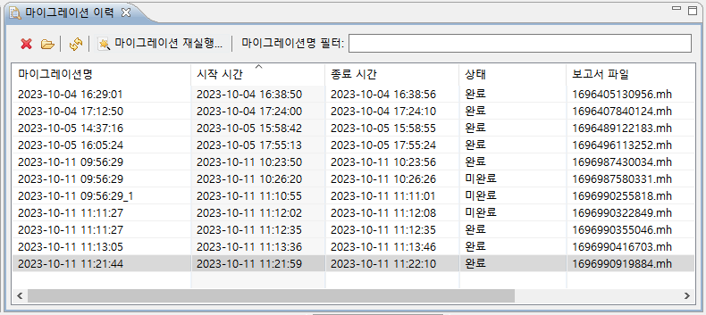

You can view reports of previous migrations and re-run the migration wizard.

**Migration Script**
^^^^^^^^^^^^^^^^^^^^^^^^^^^^^^^^^^^^^^^^^^^^^^^^^^^^^^^^^^

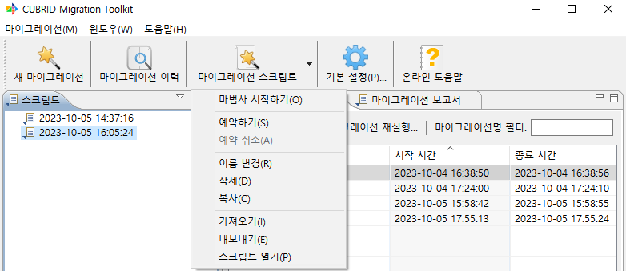

After selecting a script in the CMT script window, clicking [Migration Script] displays available functions for that script.

- Start Wizard: You can run the content recorded in the script as is. You can also modify the saved content before running.

- Schedule: You can schedule the migration start based on the content recorded in the script.

You can set up one-time or daily recurring execution.

(On Linux, you can set up recurrence using Cron syntax.)

   .. image:: ./cmt_images/image3.png
      :width: 4.08333in
      :height: 3.07222in

- Rename: You can change the name of the selected script.

- Delete: Deletes the selected script.

- Copy: You can create another script by copying the content of the selected script.

- Import: You can import a script from the local PC or from another PC. When importing a script from another PC, SSH port must be open as SSH is used.

- Export: You can save the script to the local PC or to another PC.

- When saving a script to another PC, SSH port must be open as SSH is used.

- Open Script: You can register a script to CMT through the file explorer.

Default Settings
----------------

**Basic Information**
^^^^^^^^^^^^^^^^^^^^^^^

.. image:: ./cmt_images/image4.png
   :width: 6.26805in
   :height: 1.63889in

You can select CMT settings.

**JDBC Driver**
^^^^^^^^^^^^^^^^^^^^^^^^^^^

.. image:: ./cmt_images/image5.png
   :width: 6.26805in
   :height: 2.92778in

You can view the JDBC drivers stored in CMT. You can configure to view by DB type.

**Migration**
^^^^^^^^^^^^^^^^^

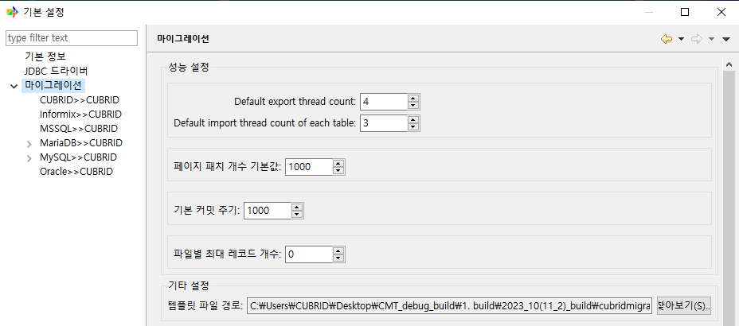

- Performance Settings
  
  - Default export thread count: You can specify the number of threads to use during migration. One thread can fetch data from one table.

  - Default import thread count of each table: Specifies the number of threads to use for inserting data into each table during migration.

  - Default commit interval: When importing large amounts of data, it is recommended to commit periodically because long transactions and accumulated change logs can slow down database input. The default is set to 1000, and higher values can be set depending on the environment.

- Other Settings

  - Template file path: Specifies the directory where temporary files are created during offline (CUBRID dump, SQL script, CSV, XML) migration tasks.

In the Migration section, you can map data types for each source DB.

**CUBRID >> CUBRID**

+------------------+-------------+--------------------+------------------+-------------+--------------------+
| Source Data Type | Precision   | Scale              | Target Data Type | Precision   | Scale              |
+==================+=============+====================+==================+=============+====================+
| bigint           |             |                    | bigint           |             |                    |
+------------------+-------------+--------------------+------------------+-------------+--------------------+
| bit              | n           |                    | bit              | n           |                    |
+------------------+-------------+--------------------+------------------+-------------+--------------------+
| n                |             | n                  |                  |             |                    |
+------------------+-------------+--------------------+------------------+-------------+--------------------+
| blob             |             |                    | blob             |             |                    |
+------------------+-------------+--------------------+------------------+-------------+--------------------+
| clob             |             |                    | clob             |             |                    |
+------------------+-------------+--------------------+------------------+-------------+--------------------+
| date             |             |                    | date             |             |                    |
+------------------+-------------+--------------------+------------------+-------------+--------------------+
| datetime         |             |                    | datetime         |             |                    |
+------------------+-------------+--------------------+------------------+-------------+--------------------+
| double           |             |                    | double           |             |                    |
+------------------+-------------+--------------------+------------------+-------------+--------------------+
| enum             |             |                    | enum             |             |                    |
+------------------+-------------+--------------------+------------------+-------------+--------------------+
| float            |             |                    | float            |             |                    |
+------------------+-------------+--------------------+------------------+-------------+--------------------+
| glo              |             |                    | blob             |             |                    |
+------------------+-------------+--------------------+------------------+-------------+--------------------+
| int              |             |                    | int              |             |                    |
+------------------+-------------+--------------------+------------------+-------------+--------------------+
| list             |             |                    | list             |             |                    |
+------------------+-------------+--------------------+------------------+-------------+--------------------+
| monetary         |             |                    | numeric          | 38          | 2                  |
+------------------+-------------+--------------------+------------------+-------------+--------------------+
| multiset         |             |                    | multiset         |             |                    |
+------------------+-------------+--------------------+------------------+-------------+--------------------+
| nchar            | n           |                    | char             | n           |                    |
+------------------+-------------+--------------------+------------------+-------------+--------------------+
| numeric          | p           | s                  | numeric          | p           | s                  |
+------------------+-------------+--------------------+------------------+-------------+--------------------+
| nvarchar         | n           |                    | varchar          | n           |                    |
+------------------+-------------+--------------------+------------------+-------------+--------------------+
| set              |             |                    | set              |             |                    |
+------------------+-------------+--------------------+------------------+-------------+--------------------+
| short            |             |                    | short            |             |                    |
+------------------+-------------+--------------------+------------------+-------------+--------------------+
| time             |             |                    | time             |             |                    |
+------------------+-------------+--------------------+------------------+-------------+--------------------+
| timestamp        |             |                    | timestamp        |             |                    |
+------------------+-------------+--------------------+------------------+-------------+--------------------+

**Informix >> CUBRID**

+------------------+-------------+--------------------+--------------------+-------------+--------------------+
| Source Data Type | Precision   | Scale              | Target Data Type   | Precision   | Scale              |
+==================+=============+====================+====================+=============+====================+
| bigint           |             |                    | bigint             |             |                    |
+------------------+-------------+--------------------+--------------------+-------------+--------------------+
| bigserial        |             |                    | bignit             |             |                    |
+------------------+-------------+--------------------+--------------------+-------------+--------------------+
| blob             | n           |                    | blob               |             |                    |
+------------------+-------------+--------------------+--------------------+-------------+--------------------+
| boolean          | n           |                    | int                |             |                    |
+------------------+-------------+--------------------+--------------------+-------------+--------------------+
| bson             | n           |                    | json               | n           |                    |
+------------------+-------------+--------------------+--------------------+-------------+--------------------+
| byte             | n           |                    | bit varying        | n           |                    |
+------------------+-------------+--------------------+--------------------+-------------+--------------------+
| char             | n           |                    | char               | n           |                    |
+------------------+-------------+--------------------+--------------------+-------------+--------------------+
| clob             | n           |                    | clob               |             |                    |
+------------------+-------------+--------------------+--------------------+-------------+--------------------+
| date             |             |                    | date               |             |                    |
+------------------+-------------+--------------------+--------------------+-------------+--------------------+
| datetime         |             |                    | datetime           |             |                    |
+------------------+-------------+--------------------+--------------------+-------------+--------------------+
| decimal          | p           | s                  | numeric            | p           | s                  |
+------------------+-------------+--------------------+--------------------+-------------+--------------------+
| float            | n           |                    | double             |             |                    |
+------------------+-------------+--------------------+--------------------+-------------+--------------------+
| int8             |             |                    | bigint             |             |                    |
+------------------+-------------+--------------------+--------------------+-------------+--------------------+
| integer          |             |                    | int                |             |                    |
+------------------+-------------+--------------------+--------------------+-------------+--------------------+
| interval         |             |                    | varchar            | 255         |                    |
+------------------+-------------+--------------------+--------------------+-------------+--------------------+
| json             | n           |                    | json               | n           |                    |
+------------------+-------------+--------------------+--------------------+-------------+--------------------+
| list             |             |                    | list (varchar)     | 255         |                    |
+------------------+-------------+--------------------+--------------------+-------------+--------------------+
| lvarchar         | n           |                    | varchar            | n           |                    |
+------------------+-------------+--------------------+--------------------+-------------+--------------------+
| money            | p           | s                  | numeric            | p           | s                  |
+------------------+-------------+--------------------+--------------------+-------------+--------------------+
| multiset         |             |                    | multiset (varchar) | 255         |                    |
+------------------+-------------+--------------------+--------------------+-------------+--------------------+
| nchar            | n           |                    | char               | n           |                    |
+------------------+-------------+--------------------+--------------------+-------------+--------------------+
| nvarchar         | n           |                    | varchar            | n           |                    |
+------------------+-------------+--------------------+--------------------+-------------+--------------------+
| serial           |             |                    | int                |             |                    |
+------------------+-------------+--------------------+--------------------+-------------+--------------------+
| serial8          |             |                    | bigint             |             |                    |
+------------------+-------------+--------------------+--------------------+-------------+--------------------+
| set              |             |                    | set (varchar)      | 255         |                    |
+------------------+-------------+--------------------+--------------------+-------------+--------------------+
| smallfloat       |             |                    | float              |             |                    |
+------------------+-------------+--------------------+--------------------+-------------+--------------------+
| smallint         |             |                    | short              |             |                    |
+------------------+-------------+--------------------+--------------------+-------------+--------------------+
| text             |             |                    | varchar            | 1073741823  |                    |
+------------------+-------------+--------------------+--------------------+-------------+--------------------+
| varchar          | n           |                    | varchar            | n           |                    |
+------------------+-------------+--------------------+--------------------+-------------+--------------------+

**MSSQL >> CUBRID**

+------------------+-------------+--------------------+------------------+-------------+--------------------+
| Source Data Type | Precision   | Scale              | Target Data Type | Precision   | Scale              |
+==================+=============+====================+==================+=============+====================+
| bigint           |             |                    | bigint           |             |                    |
+------------------+-------------+--------------------+------------------+-------------+--------------------+
| binary           | n           |                    | bit              | n           |                    |
+------------------+-------------+--------------------+------------------+-------------+--------------------+
| bit              | 1           |                    | short            |             |                    |
+------------------+-------------+--------------------+------------------+-------------+--------------------+
| char             | n           |                    | char             | n           |                    |
+------------------+-------------+--------------------+------------------+-------------+--------------------+
| date             |             |                    | date             |             |                    |
+------------------+-------------+--------------------+------------------+-------------+--------------------+
| datetime         |             |                    | datetime         |             |                    |
+------------------+-------------+--------------------+------------------+-------------+--------------------+
| datetime2        |             |                    | datetime         |             |                    |
+------------------+-------------+--------------------+------------------+-------------+--------------------+
| datetimeoffset   |             |                    | varchar          | 34          |                    |
+------------------+-------------+--------------------+------------------+-------------+--------------------+
| decimal          | p           | s                  | numeric          | p           | s                  |
+------------------+-------------+--------------------+------------------+-------------+--------------------+
| float            |             |                    | float            |             |                    |
+------------------+-------------+--------------------+------------------+-------------+--------------------+
| geography        |             |                    | bit varying      | 1073741823  |                    |
+------------------+-------------+--------------------+------------------+-------------+--------------------+
| meometry         |             |                    | bit varying      | 1073741823  |                    |
+------------------+-------------+--------------------+------------------+-------------+--------------------+
| hierarchyid      |             |                    | bit varying      | 7136        |                    |
+------------------+-------------+--------------------+------------------+-------------+--------------------+
| image            |             |                    | blob             |             |                    |
+------------------+-------------+--------------------+------------------+-------------+--------------------+
| int              |             |                    | int              |             |                    |
+------------------+-------------+--------------------+------------------+-------------+--------------------+
| money            |             |                    | numeric          | 19          | 4                  |
+------------------+-------------+--------------------+------------------+-------------+--------------------+
| nchar            | n           |                    | char             | n           |                    |
+------------------+-------------+--------------------+------------------+-------------+--------------------+
| ntext            |             |                    | clob             |             |                    |
+------------------+-------------+--------------------+------------------+-------------+--------------------+
| numeric          | p           | s                  | numeric          | p           | s                  |
+------------------+-------------+--------------------+------------------+-------------+--------------------+
| nvarchar         | n           |                    | varchar          | n           |                    |
+------------------+-------------+--------------------+------------------+-------------+--------------------+
| real             |             |                    | float            |             |                    |
+------------------+-------------+--------------------+------------------+-------------+--------------------+
| smalldatetime    |             |                    | datetime         |             |                    |
+------------------+-------------+--------------------+------------------+-------------+--------------------+
| smallint         |             |                    | short            |             |                    |
+------------------+-------------+--------------------+------------------+-------------+--------------------+
| smallmoney       |             |                    | numeric          | 10          | 4                  |
+------------------+-------------+--------------------+------------------+-------------+--------------------+
| sql_variant      |             |                    | varchar          | 8000        |                    |
+------------------+-------------+--------------------+------------------+-------------+--------------------+
| sysname          |             |                    | varchar          | 128         |                    |
+------------------+-------------+--------------------+------------------+-------------+--------------------+
| text             |             |                    | clob             |             |                    |
+------------------+-------------+--------------------+------------------+-------------+--------------------+
| time             |             |                    | time             |             |                    |
+------------------+-------------+--------------------+------------------+-------------+--------------------+
| timestamp        |             |                    | bit varying      | 64          |                    |
+------------------+-------------+--------------------+------------------+-------------+--------------------+
| tinyint          |             |                    | short            |             |                    |
+------------------+-------------+--------------------+------------------+-------------+--------------------+
| uniqueidentifier |             |                    | varchar          | 36          |                    |
+------------------+-------------+--------------------+------------------+-------------+--------------------+
| varbinary        | n           |                    | bit varying      | n           |                    |
+------------------+-------------+--------------------+------------------+-------------+--------------------+
| varchar          | n           |                    | varchar          | n           |                    |
+------------------+-------------+--------------------+------------------+-------------+--------------------+
| xml              |             |                    | clob             |             |                    |
+------------------+-------------+--------------------+------------------+-------------+--------------------+

**MariaDB >> CUBRID**

+--------------------+-------------+--------------------+------------------+-------------+--------------------+
| Source Data Type   | Precision   | Scale              | Target Data Type | Precision   | Scale              |
+====================+=============+====================+==================+=============+====================+
| bigint             |             |                    | bigint           |             |                    |
+--------------------+-------------+--------------------+------------------+-------------+--------------------+
| bigint unsigned    |             |                    | numeric          | 20          |                    |
+--------------------+-------------+--------------------+------------------+-------------+--------------------+
| binary             | n           |                    | bit              | n           |                    |
+--------------------+-------------+--------------------+------------------+-------------+--------------------+
| bit                | n           |                    | bit              |             |                    |
+--------------------+-------------+--------------------+------------------+-------------+--------------------+
| bit                | 1           |                    | short            |             |                    |
+--------------------+-------------+--------------------+------------------+-------------+--------------------+
| blob               |             |                    | blob             |             |                    |
+--------------------+-------------+--------------------+------------------+-------------+--------------------+
| bool               |             |                    | short            |             |                    |
+--------------------+-------------+--------------------+------------------+-------------+--------------------+
| boolean            |             |                    | short            |             |                    |
+--------------------+-------------+--------------------+------------------+-------------+--------------------+
| char               | n           |                    | char             | n           |                    |
+--------------------+-------------+--------------------+------------------+-------------+--------------------+
| date               |             |                    | date             |             |                    |
+--------------------+-------------+--------------------+------------------+-------------+--------------------+
| datetime           |             |                    | datetime         |             |                    |
+--------------------+-------------+--------------------+------------------+-------------+--------------------+
| decimal            | p           | s                  | numeric          | p           | s                  |
+--------------------+-------------+--------------------+------------------+-------------+--------------------+
| decimal unsigned   | p           | s                  | numeric          | p           | s                  |
+--------------------+-------------+--------------------+------------------+-------------+--------------------+
| double             |             |                    | double           |             |                    |
+--------------------+-------------+--------------------+------------------+-------------+--------------------+
| double unsigned    |             |                    | double           |             |                    |
+--------------------+-------------+--------------------+------------------+-------------+--------------------+
| enum               |             |                    | enum             |             |                    |
+--------------------+-------------+--------------------+------------------+-------------+--------------------+
| float              |             |                    | float            |             |                    |
+--------------------+-------------+--------------------+------------------+-------------+--------------------+
| float unsigned     |             |                    | float            |             |                    |
+--------------------+-------------+--------------------+------------------+-------------+--------------------+
| int                |             |                    | int              |             |                    |
+--------------------+-------------+--------------------+------------------+-------------+--------------------+
| int unsigned       |             |                    | bigint           |             |                    |
+--------------------+-------------+--------------------+------------------+-------------+--------------------+
| longblob           |             |                    | blob             |             |                    |
+--------------------+-------------+--------------------+------------------+-------------+--------------------+
| longtext           |             |                    | varchar          | 1073741823  |                    |
+--------------------+-------------+--------------------+------------------+-------------+--------------------+
| mediumblob         |             |                    | blob             |             |                    |
+--------------------+-------------+--------------------+------------------+-------------+--------------------+
| mediumint          |             |                    | int              |             |                    |
+--------------------+-------------+--------------------+------------------+-------------+--------------------+
| mediumint unsigned |             |                    | int              |             |                    |
+--------------------+-------------+--------------------+------------------+-------------+--------------------+
| mediumtext         |             |                    | varchar          | 16277215    |                    |
+--------------------+-------------+--------------------+------------------+-------------+--------------------+
| numeric            | p           | s                  | numeric          | p           | s                  |
+--------------------+-------------+--------------------+------------------+-------------+--------------------+
| set                |             |                    | set (varchar)    | 255         |                    |
+--------------------+-------------+--------------------+------------------+-------------+--------------------+
| smallint           |             |                    | short            |             |                    |
+--------------------+-------------+--------------------+------------------+-------------+--------------------+
| smallint unsigned  |             |                    |                  | int         |                    |
+--------------------+-------------+--------------------+------------------+-------------+--------------------+
| text               |             |                    | varchar          | 65535       |                    |
+--------------------+-------------+--------------------+------------------+-------------+--------------------+
| time               |             |                    | time             |             |                    |
+--------------------+-------------+--------------------+------------------+-------------+--------------------+
| timestamp          |             |                    | timestamp        |             |                    |
+--------------------+-------------+--------------------+------------------+-------------+--------------------+
| tinyblob           |             |                    | bit varying      | 2040        |                    |
+--------------------+-------------+--------------------+------------------+-------------+--------------------+
| tinyint            |             |                    | short            |             |                    |
+--------------------+-------------+--------------------+------------------+-------------+--------------------+
| tinyint unsigned   |             |                    | short            |             |                    |
+--------------------+-------------+--------------------+------------------+-------------+--------------------+
| tinytext           |             |                    | varchar          | 255         |                    |
+--------------------+-------------+--------------------+------------------+-------------+--------------------+
| varbinary          | nchar       |                    | bit varying      |             |                    |
+--------------------+-------------+--------------------+------------------+-------------+--------------------+
| varchar            | n           |                    | varchar          | n           |                    |
+--------------------+-------------+--------------------+------------------+-------------+--------------------+
| year               |             |                    | char             | 4           |                    |
+--------------------+-------------+--------------------+------------------+-------------+--------------------+

**MySQL >> CUBRID**

+--------------------+-------------+--------------------+------------------+-------------+--------------------+-----+
| Source Data Type   | Precision   | Scale              | Target Data Type | Precision   | Scale              |     |
+====================+=============+====================+==================+=============+====================+=====+
| bigint             |             |                    | bigint           |             |                    |     |
+--------------------+-------------+--------------------+------------------+-------------+--------------------+-----+
| bigint unsigned    |             |                    | numeric          | 20          |                    |     |
+--------------------+-------------+--------------------+------------------+-------------+--------------------+-----+
| binary             | n           |                    | bit              | n           |                    |     |
+--------------------+-------------+--------------------+------------------+-------------+--------------------+-----+
| bit                | n           |                    | bit              |             |                    |     |
+--------------------+-------------+--------------------+------------------+-------------+--------------------+-----+
| bit                | 1           |                    | short            |             |                    |     |
+--------------------+-------------+--------------------+------------------+-------------+--------------------+-----+
| blob               |             |                    | blob             |             |                    |     |
+--------------------+-------------+--------------------+------------------+-------------+--------------------+-----+
| bool               |             |                    | short            |             |                    |     |
+--------------------+-------------+--------------------+------------------+-------------+--------------------+-----+
| boolean            |             |                    | short            |             |                    |     |
+--------------------+-------------+--------------------+------------------+-------------+--------------------+-----+
| char               | n           |                    | char             | n           |                    |     |
+--------------------+-------------+--------------------+------------------+-------------+--------------------+-----+
| date               |             |                    | date             |             |                    |     |
+--------------------+-------------+--------------------+------------------+-------------+--------------------+-----+
| datetime           |             |                    | datetime         |             |                    |     |
+--------------------+-------------+--------------------+------------------+-------------+--------------------+-----+
| decimal            | p           | s                  | numeric          | p           | s                  |     |
+--------------------+-------------+--------------------+------------------+-------------+--------------------+-----+
| decimal unsigned   | p           | s                  | numeric          | p           | s                  |     |
+--------------------+-------------+--------------------+------------------+-------------+--------------------+-----+
| double             |             |                    | double           |             |                    |     |
+--------------------+-------------+--------------------+------------------+-------------+--------------------+-----+
| double unsigned    |             |                    | double           |             |                    |     |
+--------------------+-------------+--------------------+------------------+-------------+--------------------+-----+
| enum               |             |                    | enum             |             |                    |     |
+--------------------+-------------+--------------------+------------------+-------------+--------------------+-----+
| float              |             |                    | float            |             |                    |     |
+--------------------+-------------+--------------------+------------------+-------------+--------------------+-----+
| float unsigned     |             |                    | float            |             |                    |     |
+--------------------+-------------+--------------------+------------------+-------------+--------------------+-----+
| int                |             |                    | int              |             |                    |     |
+--------------------+-------------+--------------------+------------------+-------------+--------------------+-----+
| int unsigned       |             |                    | bigint           |             |                    |     |
+--------------------+-------------+--------------------+------------------+-------------+--------------------+-----+
| longblob           |             |                    | blob             |             |                    |     |
+--------------------+-------------+--------------------+------------------+-------------+--------------------+-----+
| longtext           |             |                    | varchar          | 1073741823  |                    |     |
+--------------------+-------------+--------------------+------------------+-------------+--------------------+-----+
| mediumblob         |             |                    | blob             |             |                    |     |
+--------------------+-------------+--------------------+------------------+-------------+--------------------+-----+
| mediumint          |             |                    | int              |             |                    |     |
+--------------------+-------------+--------------------+------------------+-------------+--------------------+-----+
| mediumint unsigned |             |                    | int              |             |                    |     |
+--------------------+-------------+--------------------+------------------+-------------+--------------------+-----+
| mediumtext         |             |                    | varchar          | 16277215    |                    |     |
+--------------------+-------------+--------------------+------------------+-------------+--------------------+-----+
| numeric            | p           | s                  | numeric          | p           | s                  |     |
+--------------------+-------------+--------------------+------------------+-------------+--------------------+-----+
| set                |             |                    | set (varchar)    | 255         |                    |     |
+--------------------+-------------+--------------------+------------------+-------------+--------------------+-----+
| smallint           |             |                    | short            |             |                    |     |
+--------------------+-------------+--------------------+------------------+-------------+--------------------+-----+
| smallint unsigned  |             |                    | int              |             |                    |     |
+--------------------+-------------+--------------------+------------------+-------------+--------------------+-----+
| text               |             |                    | varchar          | 65535       |                    |     |
+--------------------+-------------+--------------------+------------------+-------------+--------------------+-----+
| time               |             |                    | time             |             |                    |     |
+--------------------+-------------+--------------------+------------------+-------------+--------------------+-----+
| timestamp          |             |                    | timestamp        |             |                    |     |
+--------------------+-------------+--------------------+------------------+-------------+--------------------+-----+
| tinyblob           |             |                    | bit varying      | 2040        |                    |     |
+--------------------+-------------+--------------------+------------------+-------------+--------------------+-----+
| tinyint            |             |                    | short            |             |                    |     |
+--------------------+-------------+--------------------+------------------+-------------+--------------------+-----+
| tinyint unsigned   |             |                    | short            |             |                    |     |
+--------------------+-------------+--------------------+------------------+-------------+--------------------+-----+
| tinytext           | n           |                    | varchar          | 255         |                    |     |
+--------------------+-------------+--------------------+------------------+-------------+--------------------+-----+
| varbinary          |             |                    | bit varying      |             |                    |     |
+--------------------+-------------+--------------------+------------------+-------------+--------------------+-----+
| varchar            | n           |                    | varchar          | n           |                    |     |
+--------------------+-------------+--------------------+------------------+-------------+--------------------+-----+
| year               |             |                    | char             | 4           |                    |     |
+--------------------+-------------+--------------------+------------------+-------------+--------------------+-----+

**Oracle >> CUBRID**

+-------------------------------+-------------+--------------------+------------------+-------------+--------------------+-----+
| Source Data Type              | Precision   | Scale              | Target Data Type | Precision   | Scale              |     |
+===============================+=============+====================+==================+=============+====================+=====+
| array                         |             |                    | list (varchar)   | 255         |                    |     |
+-------------------------------+-------------+--------------------+------------------+-------------+--------------------+-----+
| bfile                         |             |                    | blob             |             |                    |     |
+-------------------------------+-------------+--------------------+------------------+-------------+--------------------+-----+
| binary_double                 |             |                    | double           |             |                    |     |
+-------------------------------+-------------+--------------------+------------------+-------------+--------------------+-----+
| binary_float                  |             |                    | float            |             |                    |     |
+-------------------------------+-------------+--------------------+------------------+-------------+--------------------+-----+
| blob                          |             |                    | blob             |             |                    |     |
+-------------------------------+-------------+--------------------+------------------+-------------+--------------------+-----+
| char                          | n           |                    | char             | n           |                    |     |
+-------------------------------+-------------+--------------------+------------------+-------------+--------------------+-----+
| clob                          |             |                    | clob             |             |                    |     |
+-------------------------------+-------------+--------------------+------------------+-------------+--------------------+-----+
| date                          |             |                    | datetime         |             |                    |     |
+-------------------------------+-------------+--------------------+------------------+-------------+--------------------+-----+
| decimal                       | p           | s                  | numeric          | p           | s                  |     |
+-------------------------------+-------------+--------------------+------------------+-------------+--------------------+-----+
| float                         |             |                    | double           |             |                    |     |
+-------------------------------+-------------+--------------------+------------------+-------------+--------------------+-----+
| integer                       |             |                    | int              |             |                    |     |
+-------------------------------+-------------+--------------------+------------------+-------------+--------------------+-----+
| interval day to second        |             |                    | varchar          | 255         |                    |     |
+-------------------------------+-------------+--------------------+------------------+-------------+--------------------+-----+
| interval year to month        |             |                    | varchar          | 255         |                    |     |
+-------------------------------+-------------+--------------------+------------------+-------------+--------------------+-----+
| long                          |             |                    | varchar          | 1073741823  |                    |     |
+-------------------------------+-------------+--------------------+------------------+-------------+--------------------+-----+
| long raw                      |             |                    | blob             |             |                    |     |
+-------------------------------+-------------+--------------------+------------------+-------------+--------------------+-----+
| nchar                         | n           |                    | char             | n           |                    |     |
+-------------------------------+-------------+--------------------+------------------+-------------+--------------------+-----+
| nclob                         |             |                    | clob             |             |                    |     |
+-------------------------------+-------------+--------------------+------------------+-------------+--------------------+-----+
| number                        |             |                    | numeric          | 38          | 15                 |     |
+-------------------------------+-------------+--------------------+------------------+-------------+--------------------+-----+
| number                        | p           | s                  | numeric          | p           | s                  |     |
+-------------------------------+-------------+--------------------+------------------+-------------+--------------------+-----+
| nvarchar2                     | n           |                    | varchar          | n           |                    |     |
+-------------------------------+-------------+--------------------+------------------+-------------+--------------------+-----+
| raw                           | n           |                    | bit varying      | n           |                    |     |
+-------------------------------+-------------+--------------------+------------------+-------------+--------------------+-----+
| real                          |             |                    | float            |             |                    |     |
+-------------------------------+-------------+--------------------+------------------+-------------+--------------------+-----+
| rowed                         |             |                    | varchar          | 64          |                    |     |
+-------------------------------+-------------+--------------------+------------------+-------------+--------------------+-----+
| timestamp                     |             |                    | timestamp        |             |                    |     |
+-------------------------------+-------------+--------------------+------------------+-------------+--------------------+-----+
| timestamp with local timezone |             |                    | datetime         |             |                    |     |
+-------------------------------+-------------+--------------------+------------------+-------------+--------------------+-----+
| timestamp with timezone       |             |                    | varchar          | 100         |                    |     |
+-------------------------------+-------------+--------------------+------------------+-------------+--------------------+-----+
| urowid                        |             |                    | varchar          | 4000        |                    |     |
+-------------------------------+-------------+--------------------+------------------+-------------+--------------------+-----+
| varchar2                      | n           |                    | varchar          | n           |                    |     |
+-------------------------------+-------------+--------------------+------------------+-------------+--------------------+-----+

Migration Wizard
----------------

**Step 1 (Select Migration Type)**
^^^^^^^^^^^^^^^^^^^^^^^^^^^^^^^^^^^^^^^^^^^^^^^

You can select the type of migration you want to perform.

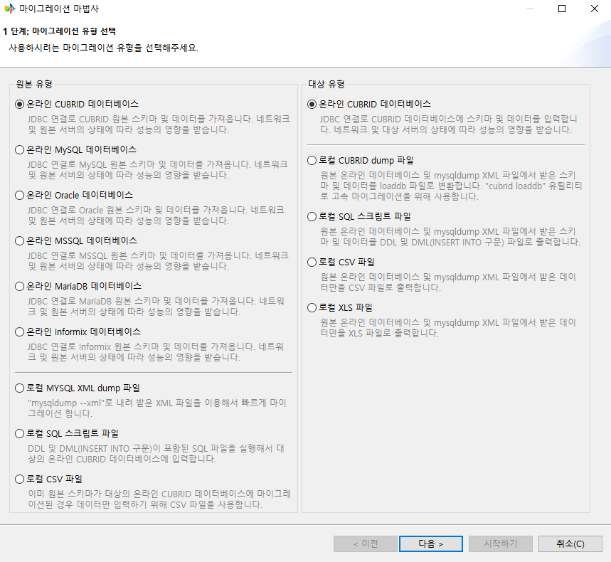

- Source Type
    - You can select the DB or file from which to extract data. DBs include CUBRID, MySQL, Oracle, MSSQL, MariaDB, and Informix. Files support MySQL XML dump, SQL script, and CSV.

- Target Type
    - There are online migration, which inserts extracted data in real-time into an operating CUBRID DB, and offline migration, which outputs data to files. Offline migration supports CUBRID dump, SQL script, CSV, and XLS files.

**Step 2 (Select Source Online Database)**
^^^^^^^^^^^^^^^^^^^^^^^^^^^^^^^^^^^^^^^^^^^^^^^

When first installed, there is no database connection information by default. You need to add and select the host information and JDBC connection for the source database from which you want to import data.

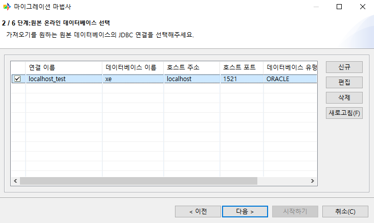

Click the [New] button to create new connection information.

.. image:: ./cmt_images/image9.png
   :width: 4.34861in
   :height: 3.64444in

CUBRID JDBC drivers are supported by default in CMT without needing to download separately.

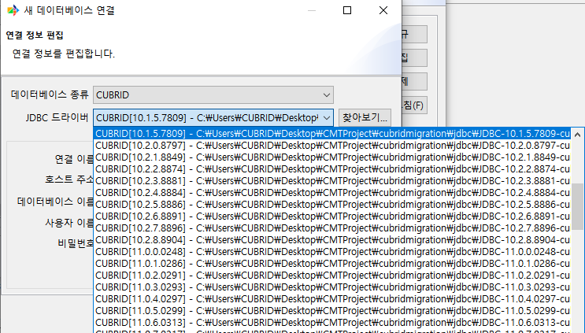

After entering the connection information, you can click the [Test] button to check if the database is accessible.

.. image:: ./cmt_images/image11.png
   :width: 5.30278in
   :height: 4.4375in

**Step 3-Online (Select Target Online CUBRID Database)**
^^^^^^^^^^^^^^^^^^^^^^^^^^^^^^^^^^^^^^^^^^^^^^^^^^^^^^^^^^

When selecting an online CUBRID database, you need to select the target database connection information. If there is no connection information, you can create it the same way as creating the source database connection information.

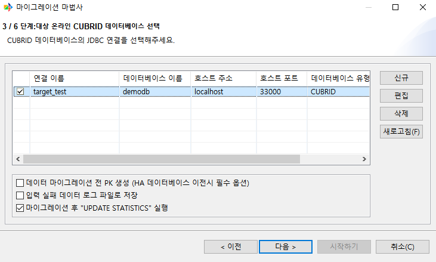

**Step 3-Offline (Output File Settings)**
^^^^^^^^^^^^^^^^^^^^^^^^^^^^^^^^^^^^^^^^^^^^^^^

When selecting offline migration (CUBRID dump, SQL script, CSV, XLS), the settings are as follows.

.. image:: ./cmt_images/image13.png
   :width: 5.90556in
   :height: 3.5125in

- File Path: You can specify the output file location. The default path is set to the output directory under the CMT installation location.

- Output File Prefix: The word prefixed to the output file name, defaulting to the user name entered in the source database connection information.

- Time Zone: Set the time zone.

- Character Set: Specify the character encoding to use when outputting to files.

- LOB files' root path: Specify the directory where LOB files will be stored.

- DB Version: Selecting 11.2 or higher outputs files with multi-schema applied; selecting 11.0 or lower outputs files without multi-schema.

- Schema File Separation: Schema files output table, view, serial, pk, fk, synonym, and grant objects. You can configure to save each object type in separate files.

- Output Files Per Table: You can output each table's data to individual files named after the table.

- Output User Creation Query: Outputs queries to create users for the privilege schemas owned by the user connected to the source database.

**Step 4 (Schema Mapping)**
^^^^^^^^^^^^^^^^^^^^^^^^^^^^

Select the schemas to migrate. For online migration, you can select the target schema from a dropdown list; for offline migration, you can directly enter the schema name.

The available target schemas vary depending on the source and target database connection user privileges.

.. image:: ./cmt_images/image15.png

+------------------+------------------------+-------------------------------------+------------------------+-------------------------------------------+
| Source\\Target   | 11.0 Normal User       | 11.0 DBA                            | 11.2 Normal User       | 11.2 DBA                                  |
+==================+========================+=====================================+========================+===========================================+
| 11.0 Normal User | target connection user | targetDB + sourceDB name            | target connection user | all target users                          |
+------------------+------------------------+-------------------------------------+------------------------+-------------------------------------------+
| 11.0 DBA         | target connection user | targetDB + sourceDB name            | target connection user | all target users                          |
+------------------+------------------------+-------------------------------------+------------------------+-------------------------------------------+
| 11.2 Normal User | target connection user | targetDB + sourceDB connection user | target connection user | source connection user + all target users |
+------------------+------------------------+-------------------------------------+------------------------+-------------------------------------------+
| 11.2 DBA         | target connection user | targetDB + all sourceDB users       | target connection user | source connection user + all target users |
+------------------+------------------------+-------------------------------------+------------------------+-------------------------------------------+

Whether you can enter a target schema depends on the DB version set in Migration Wizard Step 3 (Output File Settings).

+----------------+-------------------------------------------+---------------------+
| Source\\Target | 11.0 or lower                             | 11.2 or higher      |
+================+===========================================+=====================+
| 11.0 or lower  | Target schema fixed to source schema name | Enter target schema |
+----------------+-------------------------------------------+---------------------+
| 11.2 or higher | Target schema fixed to source schema name | Enter target schema |
+----------------+-------------------------------------------+---------------------+

**Step 5 (Object Mapping)**
^^^^^^^^^^^^^^^^^^^^^^^^^^^^^^

This step allows you to review and modify the objects to migrate. Available objects include table, pk, fk, index, view, serial, synonym, and grant.

.. image:: ./cmt_images/image74.png
   :width: 6.26805in
   :height: 3.60278in

- Table
    - You can view information about source tables, target schemas, and target tables.

.. image:: ./cmt_images/image75.png
   :width: 6.26805in
   :height: 1.84305in

- Data: Select whether to migrate table data (rows). If not selected, only the table schema is migrated.

- Create: Exclude the table from migration. If Create is not selected, other options cannot be selected.

- Replace: If a table with the same name already exists in the target database, delete it and create a new table.

- PK: Select whether to create the table's primary key.

Selecting a table node displays the column information for that table.

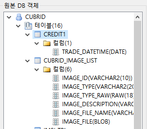

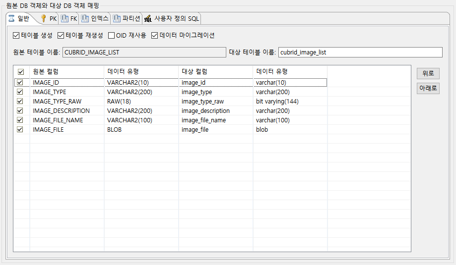

- Create Table: Exclude the table from migration. If unchecked, Replace Table and Reuse OID cannot be selected.

- Replace Table: If a table with the same name already exists in the target database, delete it and create a new table.

- Reuse OID: Select whether to use the REUSE_OID option when creating the table. For more details on REUSE_OID, please refer to the documentation.

- Data Migration: Select whether to migrate table data (rows). If not selected, only the table schema is migrated.

PK (Primary key)
^^^^^^^^^^^^^^^^^^^^^^^^

You can view the table's PK information. You can change the PK name for the target database. You can see which columns are PK columns and which are not.

To change PK columns, move columns from non-PK columns to target PK columns, and the PK will be created with the columns in the target PK column list.

.. image:: ./cmt_images/image78.png
   :width: 6.26805in
   :height: 4.48611in

.. image:: ./cmt_images/image79.png
   :width: 5.28333in
   :height: 3.79444in

FK (Foreign key)
^^^^^^^^^^^^^^^^^^^^^^^^

You can view and modify the table's FK names and settings.

.. image:: ./cmt_images/image80.png
   :width: 6.14583in
   :height: 3.44861in

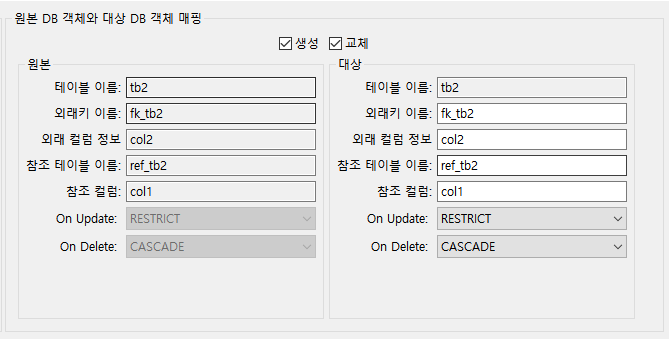

- Create: Exclude the FK from migration. If Create is not selected, Replace cannot be selected.

- Replace: If a foreign key with the same name already exists in the target database, delete it and create a new foreign key.

- Table Name: The name of the table that owns the FOREIGN KEY.

- Foreign Key Name: Specifies the name of the FOREIGN KEY constraint.

- Foreign Column Info: The name of the column defined as the foreign key.

- Reference Table Name: The name of the referenced table.

- Reference Column: The name of the referenced primary key column.

- On Update: Defines the action to perform when trying to update the primary key value referenced by the foreign key. You can select one of NO ACTION, RESTRICT, or SET NULL.

- On Delete: Defines the action to perform when trying to delete the primary key value referenced by the foreign key. You can select one of NO ACTION, RESTRICT, CASCADE, or SET NULL.

Index
^^^^^^^^^^^^^^^^^^

You can view and modify the table's index settings.

.. image:: ./cmt_images/image82.png
   :width: 6.26805in
   :height: 2.7875in

.. image:: ./cmt_images/image83.png
   :width: 6.26805in
   :height: 2.74583in

- Create: Exclude the index from migration. If Create is not selected, Replace cannot be selected.

- Replace: If an index with the same name already exists in the target database, delete it and create a new index.

- Table Name: The name of the table to create the index on.

- Index Name: The name of the index to create. The index name must be unique within the table.

- REVERSE: Create as a Reverse Index.

- UNIQUE: Create a unique index with unique values.

- Column: Specify the column name to apply the index to.

- Order: Select ASC or DESC from the dropdown list to set the column sort direction.

Column
^^^^^^^^^^^^^^^^^^

You can configure column details by selecting a column node.

.. image:: ./cmt_images/image84.png
   :width: 6.26805in
   :height: 4.10833in

View
^^^^^^^^^^^^^^^^^^

You can view source view and target view information.

.. image:: ./cmt_images/image85.png
   :width: 6.26805in
   :height: 3.60833in

- Create: Exclude the view from migration. If Create is not checked, Replace cannot be selected.

- Replace: If a view with the same name already exists in the target database, delete it and create a new view.

    - Through the view detail page, you can modify the view name and View Query Spec.

.. image:: ./cmt_images/image86.png
   :width: 6.15556in
   :height: 4.23194in

Serial
^^^^^^^^^^^^^^^^^^

You can view source serial and target serial information.

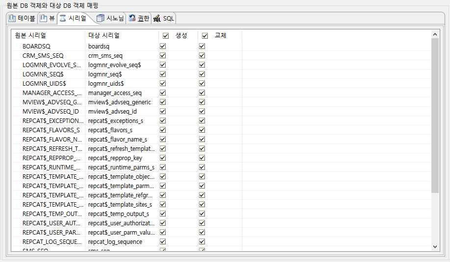

- Create: Exclude the serial from migration. If Create is not checked, Replace cannot be selected.

- Replace: If a serial with the same name already exists in the target database, delete it and create a new serial.

    - Through the serial detail page, you can modify the name, start value, increment value, minimum value, maximum value, cache value, and cycle.

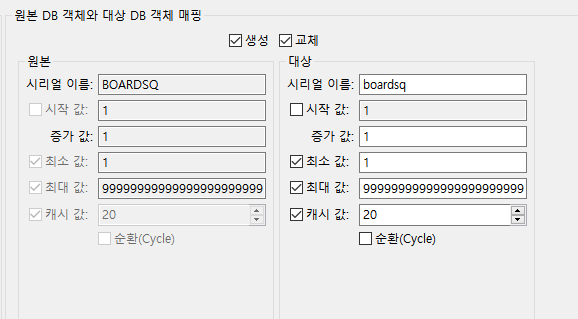

- Serial Name: Specifies the name of the serial.

- Start Value: Specifies the initial serial number to be generated.

- Increment Value: Specifies the interval between serial numbers.

- Minimum Value: Specifies the minimum value of the serial.

- Maximum Value: Specifies the maximum value of the serial.

- Cache Value: Specifies the cached_num value.

- Cycle: Specifies whether to continuously generate values after the serial value reaches the maximum or minimum value.

Synonym
^^^^^^^^^^^^^^^^^^

You can view source synonym and target synonym information.

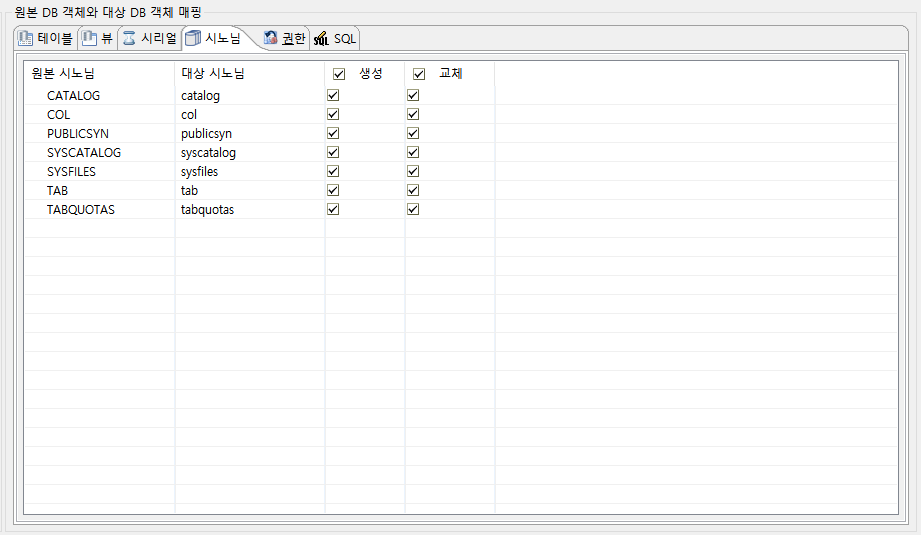

- Create: Exclude the synonym from migration. If Create is not checked, Replace cannot be selected.

- Replace: If a synonym with the same name already exists in the target database, delete it and create a new synonym.

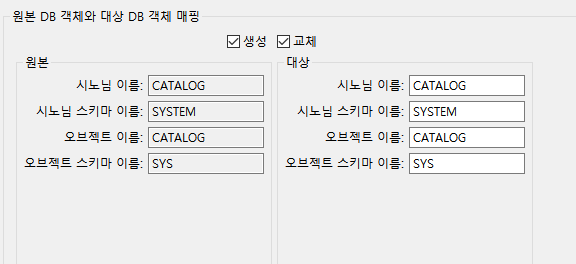

- Synonym Name: Specifies the name of the synonym.

- Synonym Schema Name: Specifies the schema name of the synonym.

- Object Name: Specifies the name of the target object.

- Object Schema Name: Specifies the schema name of the target object.

Grant
^^^^^^^^^^^^^^^^^^

You can view privilege type, source schema, source object, and target schema information.

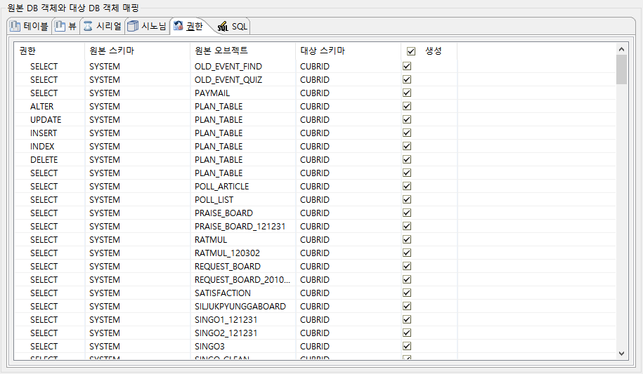

Create: Exclude the privilege from migration.

SQL
^^^^^^^^^^^^^^^^^^
Users can output desired records and tables to the target through queries.

.. image:: ./cmt_images/image122.png

- Add SQL: Displays a query input window where you can enter the desired query.

- Edit SQL: Edit the entered query.

- Delete SQL: Delete the entered query.

- Import SQL: Select an SQL file to import queries.

- Data: Confirms whether to extract records through the entered query.

- Create: Creates a table with the "target table" name through the entered query.

- Replace: If a table with the "target table" name already exists, replace that table.

**Step 6**
^^^^^^^^^^^^^^^^^
You can review the configured information before executing the migration.

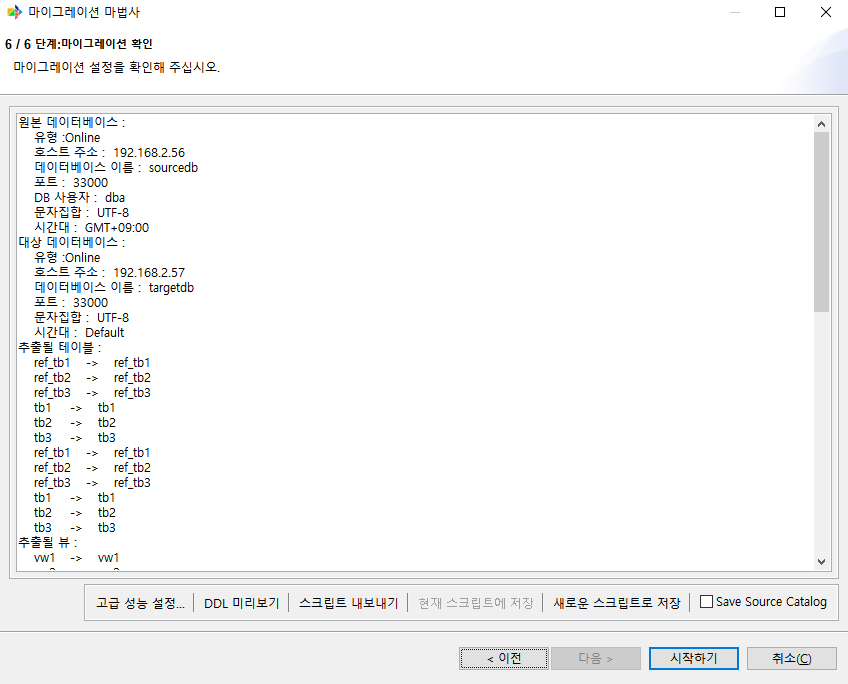

Advanced Performance Settings

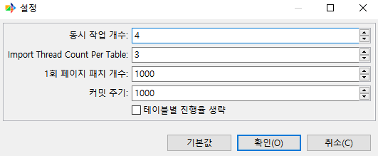

- Concurrent Job Count: You can specify the number of threads to use during migration.

- Commit Interval: When importing large amounts of data, it is recommended to commit periodically because long transactions and accumulated change logs can slow down database input. The default is set to 1000, and higher values can be set depending on the environment.

- Skip Per-Table Progress: You can skip real-time per-table row progress display during migration.

DDL Preview
^^^^^^^^^^^^^^^^^^

You can preview the DDL of objects to be migrated.

.. image:: ./cmt_images/image94.png
   :width: 6.26805in
   :height: 5.06944in

Export Script
^^^^^^^^^^^^^^^^^^

- You can export the configuration set in the Migration Wizard to a script file. You can export to the local PC or to a remote server.

- Save to Current Script: If the migration task was executed from a script or saved as a script, you can overwrite the changes made in the Migration Wizard settings to the current script.

- Save as New Script: You can save the Migration Wizard settings as a new script.

Save Source Catalog

**Execute Migration**
^^^^^^^^^^^^^^^^^^^^^^^^^^

.. image:: ./cmt_images/image95.png
   :width: 4.92778in
   :height: 2.66667in

- Start Now: The migration starts immediately.

- Schedule: The migration doesn't start immediately but runs at the time scheduled by the user.

- Migration Schedule Settings: You can configure migration schedule settings.

.. image:: ./cmt_images/image96.png
    :width: 4.10417in
    :height: 3.08333in

- Run Once: The migration runs only once at the user-specified time.

- Run Daily: The migration runs daily at the user-specified time.

Migration Report
----------------

**Save**
^^^^^^^^^^^^^^^^^^

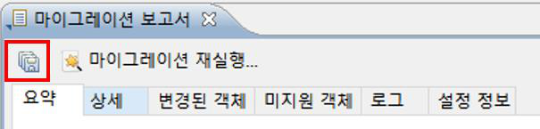

Click the save icon to save the migration report to the local PC.

**Re-run Migration**
^^^^^^^^^^^^^^^^^^^^^^^^^^^

.. image:: ./cmt_images/image98.png
   :width: 6.15556in
   :height: 1.41667in

Immediately re-run the previously performed migration.

**Summary**
^^^^^^^^^^^

.. image:: ./cmt_images/image99.png
   :width: 6.26805in
   :height: 3.4375in

You can view the count of objects retrieved from the source database and the objects migrated to the target database.

**Details**
^^^^^^^^^^^

.. image:: ./cmt_images/image100.png
   :width: 6.26805in
   :height: 4.12639in

You can view the type, name, and DDL of migrated objects.

**Modified Objects**
^^^^^^^^^^^^^^^^^^^^

.. image:: ./cmt_images/image101.png
   :width: 6.26805in
   :height: 2.73194in

You can view objects whose names have been changed. Only schema, table, view, serial, and synonym are supported.

**Unsupported Objects**
^^^^^^^^^^^^^^^^^^^^^^^^^

.. image:: ./cmt_images/image102.png
   :width: 6.26805in
   :height: 3.79028in

You can view the DDL of objects that are not supported for migration. Functions, triggers, and procedures are not supported. For Grant, migration is not supported when the target database connection user does not have DBA or DBA privileges during online migration.

**Log**
^^^^^^^^^^^^^^^^^^^^^^^^^

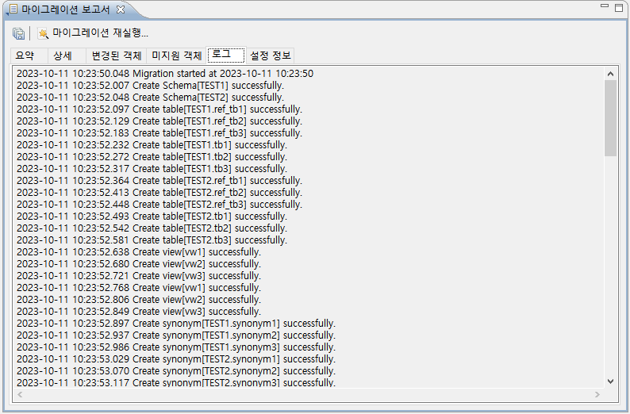

You can view the object creation time, DDL, and success status.

**Configuration Information**
^^^^^^^^^^^^^^^^^^^^^^^^^^^^^^^^^^^^^^^^^

.. image:: ./cmt_images/image104.png
   :width: 6.26805in
   :height: 4.1625in

You can view the final information confirmed in Migration Wizard Step 6.

Migration Scenarios
--------------------

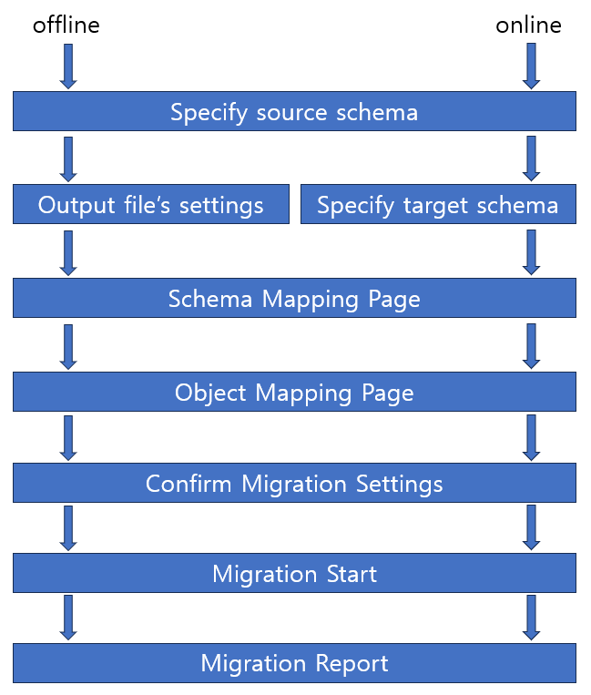

Perform migration by remotely connecting to an operating CUBRID database (Scenario 1)
Perform migration to a CUBRID database as a dump file on local PC (Scenario 2)

Scenario 1
^^^^^^^^^^^^^^^^^^

**A. New Migration**

Click [New Migration] in the upper left to launch the migration wizard for a new migration task.

.. image:: ./cmt_images/image106.png
    :width: 6.26805in
    :height: 4.75556in

**B. Select Migration Type**

Select [Online CUBRID Database] for both source type and target type.

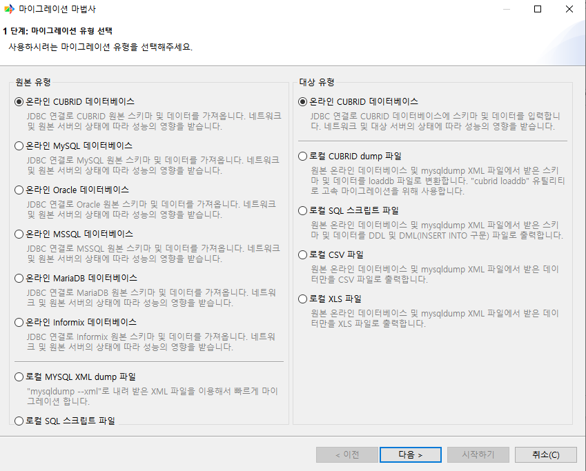

**C. Select Source Online Database**

Select the source database from which to retrieve schema information and data.

If there is saved connection information, just select it. If not, click [New] to save the connection information first.

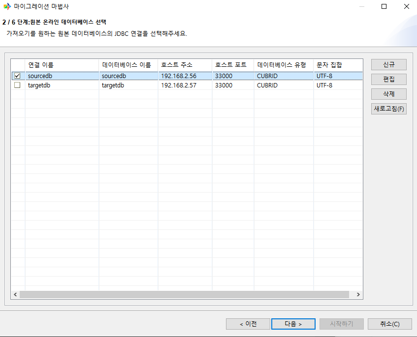

**D. Select Target Online Database**

Select the target database to migrate the information retrieved from the source database.

If there is saved connection information, just select it. If not, click [New] to save the connection information first.

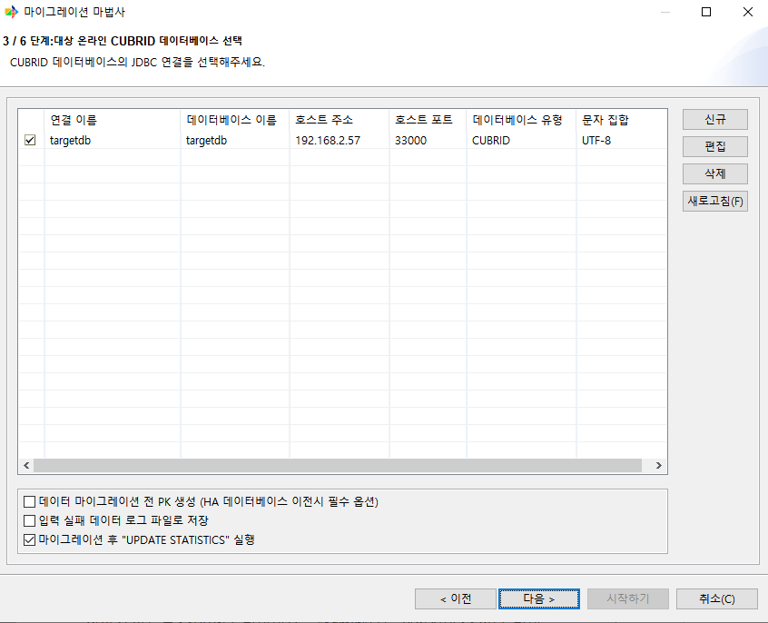

**E. Select Migration Schema**

You can select the schemas to migrate. Depending on the source and target database connection users, you may also be able to change the target schema.

.. image:: ./cmt_images/image110.png
    :width: 6.26805in
    :height: 5.06528in

**F. Object Settings and Confirmation**

You can review and modify the objects retrieved from the source database.

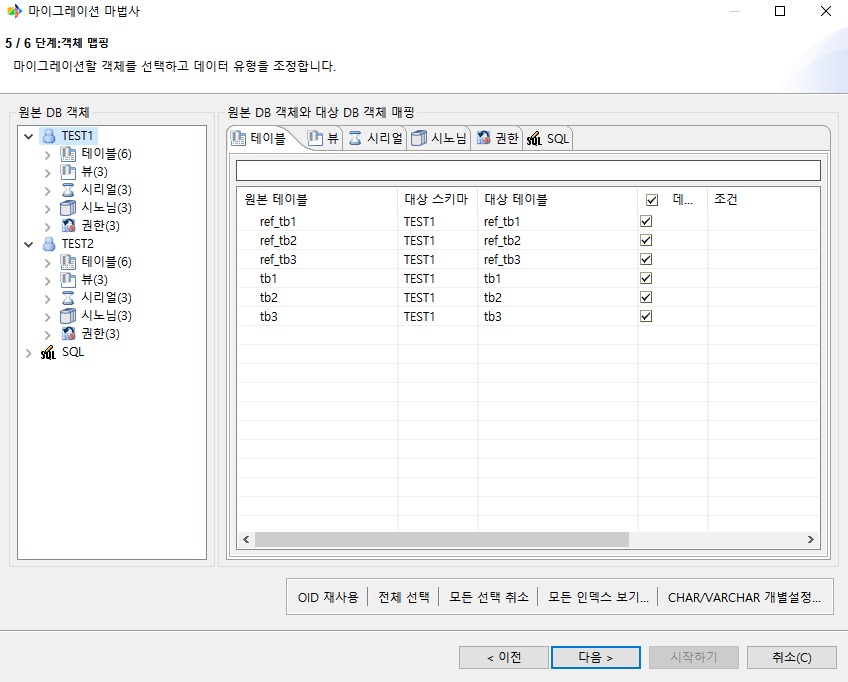

**G. Final Confirmation Before Migration**

You can do a final review of the configured settings before migration.

Click [Start] in the lower right to begin the migration.

.. image:: ./cmt_images/image112.png
    :width: 6.26805in
    :height: 5.05556in

**H. Migration Progress**

You can monitor the migration progress in real-time.

The upper table shows the progress of records in each table, and the lower log shows the currently executing objects.

The log can be reviewed again in the migration report after the migration is complete.

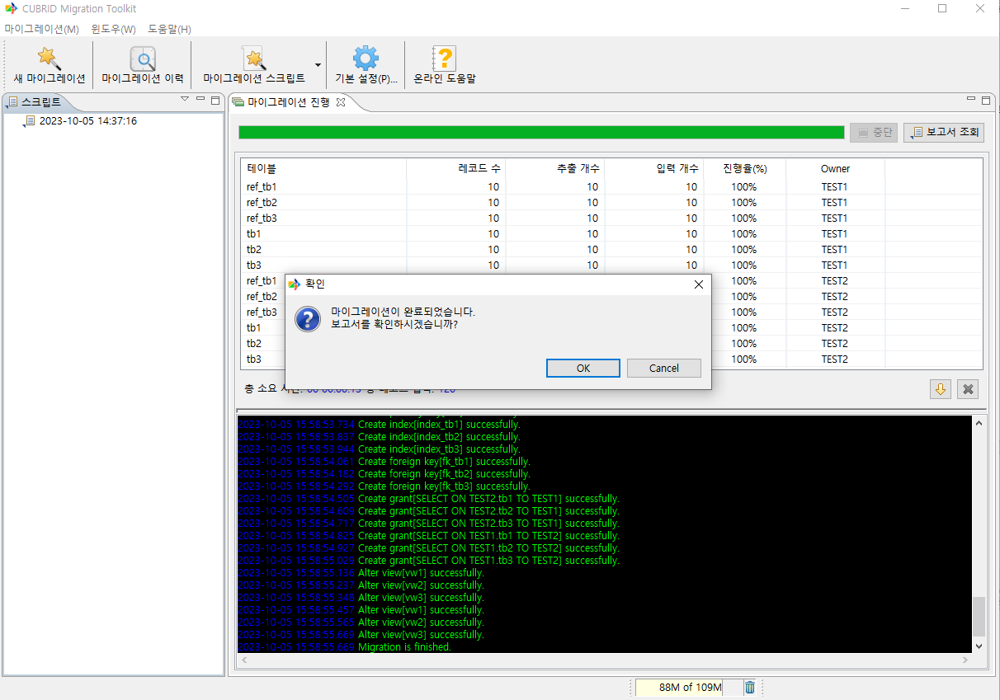

**I. Migration Report Confirmation**

After the migration task is complete, you can view the results as a report.

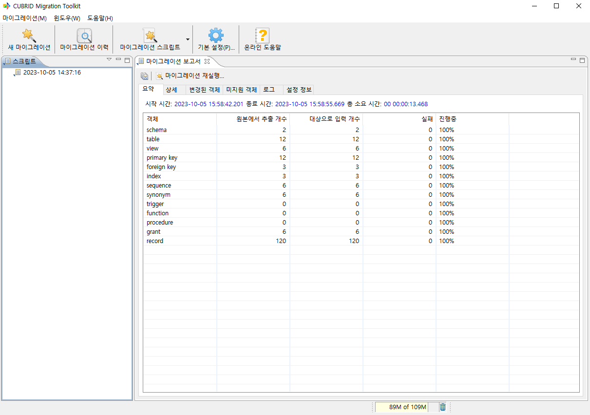

Scenario 2
^^^^^^^^^^^^^^^^^^

**A. New Migration**

Click [New Migration] in the upper left to launch the migration wizard for a new migration task.

.. image:: ./cmt_images/image106.png
    :width: 6.26805in
    :height: 4.75556in

**B. Select Migration Type**

.. image:: ./cmt_images/image115.png
    :width: 6.26805in
    :height: 5.06528in

**C. Select Source Online Database**

Select the source database from which to retrieve schema information and data.

If there is saved connection information, just select it. If not, click [New] to save the connection information first.

**D. Output File Settings**

You can set the path to save output files and select features like DB version and schema file separation.

.. image:: ./cmt_images/image116.png
    :width: 6.26805in
    :height: 5.05278in

**E. Select Migration Schema**

You can select the schemas to migrate. For offline migration, you must directly specify the target schema name based on the target database connection user.

.. image:: ./cmt_images/image117.png
    :width: 6.26805in
    :height: 5.05694in

**F. Object Settings and Confirmation**

You can review and modify the objects retrieved from the source database.

**G. Final Confirmation Before Migration**

You can do a final review of the configured settings before migration.

Click [Start] in the lower right to begin the migration.

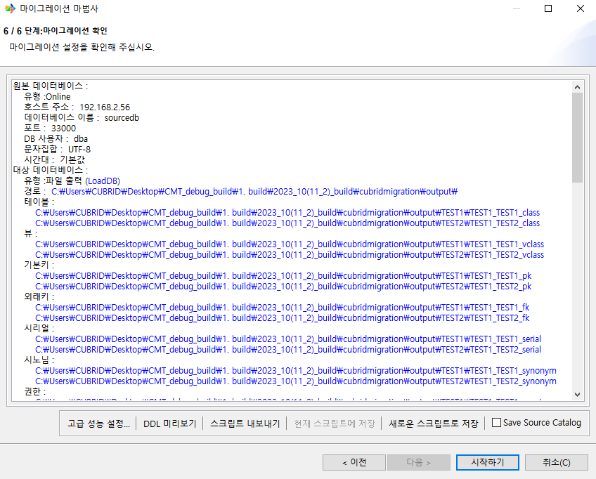

**H. Migration Progress**

You can monitor the migration progress in real-time.

The upper table shows the progress of records in each table, and the lower log shows the currently executing objects.

The log can be reviewed again in the migration report after the migration is complete.

.. image:: ./cmt_images/image120.png
    :width: 6.26805in
    :height: 4.41528in

**I. Migration Report Confirmation**

After the migration task is complete, you can view the results as a report.

.. image:: ./cmt_images/image121.png
    :width: 6.26805in
    :height: 4.41806in

