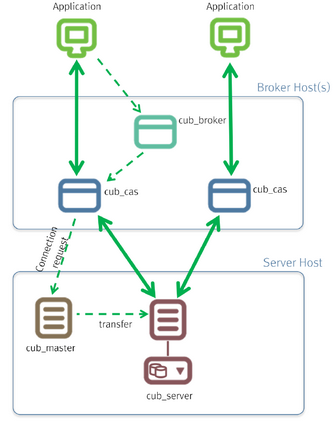

:meta-keywords: cubrid install, cubrid compatibility, cubrid service, cubrid manager, run cubrid
:meta-description: CUBRID supported platforms, hardware and software requirements. How to install and run CUBRID engine and CUBRID manager.

**********************
Introduction to CUBRID
**********************

This chapter explains the architecture and features of CUBRID. 
CUBRID is an object-relational database management system (DBMS) consisting of the database server, the broker, and the CUBRID Manager. 
It is optimized for Internet data services, and provides various user-friendly features.

This chapter covers the following topics:

*   System Architecture: This page contains information about database volume structure, server process, broker process, interface modules, etc.
*   Features of CUBRID: This page contains information about transaction, backup and recovery, partitioning, index, HA, Java stored procedure, click counter, relational data model extension, etc.

System Architecture
===================

Process Structure
-----------------

CUBRID is an object-relational database management system (DBMS) consisting of the database server, the broker, and the CUBRID Manager.

*   As the core component of the CUBRID database management system, the database server stores and manages data in multi-threaded client/server architecture. The database server processes the queries requested by users and manages objects in the database. The CUBRID database server provides seamless transactions using locking and logging methods even when multiple users use the database at once. It also supports database backup and restore for the operation.

*   The broker is a CUBRID-specific middleware that relays the communication between the database server and external applications. It provides functions including connection pooling, monitoring, and log tracing and analysis.

*   The CUBRID Manager is a GUI tool that allows users to remotely manage the database and the broker. It also provides the Query Editor, a convenient tool that allows users to execute SQL queries on the database server. 

*   The CUBRID Java SP server is an execution server that processes Java stored procedures/functions requested from the database server.

.. FIXME: For more information about CUBRID Manager, see http://www.cubrid.org/wiki_tools/entry/cubrid-manager.

.. image:: /images/process_structure.png

.. _database-volume-structure:

Database Volume Structure
-------------------------

The following diagram illustrates the CUBRID database volume structure. As you can see, the database is divided into three volumes: permanent, temporary and backup. This chapter will examine each volume and its characteristics.

.. image:: /images/database_volume_structure.png

For commands to create, add or delete the database volume, see :ref:`creating-database`, :ref:`adding-database-volume` and :ref:`deleting-database`.

Permanent Volume
^^^^^^^^^^^^^^^^

**Data Volumes**

Permanent data volumes are database volumes that exists permanently once they are created.

It usually stores data that needs to be persistent after database restart or crash. The possible types of permanent data are:

*   Tables (rows and multimedia data) are internally stored into heap files and heap overflow files, one file for each table.
*   Indexes (keys and multimedia data) are internally stored into b-tree files and b-tree overflow files, one file for each index.
*   System data is internally stored into several types of files: file tracker, vacuum data, dropped files tracker, and class names hash.

User can specifically assign some permanent data volumes to store temporary data. These volumes are permanent in the sense that they are never destroyed, but behave similarly to :ref:`temporary-volumes`.

.. note::

    If you have used older CUBRID version, you may know that we used to have several types of permanent data volumes: **generic**, **data** and **index**. This classification is deprecated, and although these options are still allowed for **cubrid createdb** and **cubrid addvoldb** commands, the created volumes will be no different and they will store any type of permanent data. The volume purpose is only classified into permanent data and temporary data.

**Control File**

The control file contains the volume, backup and log information in the database.

*   **Volume Information**: The information that includes names, locations and internal volume identifiers of all the volumes in the database. When the database restarts, the CUBRID reads the volume information control file. It records a new entry to that file when a new database volume is added.

*   **Backup Information**: Locations of all the backups for data, index, and generic volumes are recorded to a backup information control file. This control file is maintained where the log files are managed.

*   **Log Information**: This information contains names of all active and archive logs. With the log information control file, you can verify the archive log information. The log information control file is created and managed at the same location as the log files.

Control files include the information about locations of database volumes, backups and logs. Since these files will be read when the database restarts, users must not modify them arbitrarily.

**Active Log**

Active log is a log that contains recent changes to the database. If a problem occurs, you can use active and archive logs to restore the database completely up to the point of the last commit before the occurrence of the fault.

**Double Write Buffer File**

Double write buffer file stores copies of data pages being flushed to disk as a protection against I/O errors. A detailed description of this file can be found in :ref:`database-volume` section.

**TDE Key File**

TDE (Transparent Data Encryption) key file contains keys for database encryption. The keys in the file are managed using the TDE utility. For more information on this, see :ref:`tde-file-based-key` and :ref:`TDE Utility<tde-utility>`.

.. _temporary-volumes:

Temporary Volume
^^^^^^^^^^^^^^^^

Temporary data volume has the opposite meaning to the permanent volume. That is, the temporary volume is a storage file created temporarily which gets destroyed when the server process terminates. These volumes are used to store intermediate and final results of query processing and sorting.

These files provide space to store intermediary and final results of queries. Based on the size of required temporary data, it will be first stored in memory (the space size is determined by the system parameter **temp_file_memory_size_in_pages** specified in **cubrid.conf**). Exceeding data has to be stored on disk.

Database will usually create and use temporary volumes to allocate disk space for temporary data. They user may however assign permanent database volumes with the purpose of storing temporary data using by running **cubrid addvoldb -p temp** command. If such volumes exist, they will have priority over temporary volumes when disk space is allocated for temporary data.

The examples of queries that can use temporary data are as follows:

*   Queries creating the resultset like **SELECT**
*   Queries including **GROUP BY** or **ORDER BY**
*   Queries including a subquery
*   Queries executing sort-merge join
*   Queries including the **CREATE INDEX** statement

To have complete control on the disk space used for temporary data and to prevent it from consuming all system disk space, our recommendation is to:

*   create permanent database volumes in advance to secure the required space for temporary data
*   limit the size of the space used in the temporary volumes when a queries are executed by setting **temp_file_max_size_in_pages** parameter in **cubrid.conf** (there is no limit by default).

Once temporary temp volume is created, it is maintained until a database restarts and its size cannot be reduced. It is recommended to make temporary temp volume automatically delete by restarting a database if its size is too big.

*   **File name of the temporary volumes**: The file name format of a temporary volume is *db_name*\ **_t**\ *num*, where *db_name* is the database name and *num* is the volume identifier. The volume identifier is decremented by 1 from 32766.

*   **Configuring the temporary volume size**: The number of temporary volumes to be created is determined by the system depending on the space size needed for processing transactions. However, users can limit the total temporary volume size by configuring the **temp_file_max_size_in_pages** parameter value in the system parameter configuration file (**cubrid.conf**). The default value is -1, which means it can be created as long as free space is available. If the **temp_file_max_size_in_pages** parameter value is configured to 0, no temporary volumes will be created, and the system will have to rely exclusively on permanent volumes assigned for temporary data.

*   **Configuring storing location of temporary volumes**: By default, temporary volumes are created where the first database volume was created. However, you can specify a different directory to store temporary volumes by configuring the **temp_volume_path** parameter value.

*   **Deleting temporary volumes**: Temporary volumes exist only while the database is running. Therefore, you must not delete the temporary volumes when running servers. They are deleted when database servers are normally terminated. When database servers are  abnormally terminated, temporary volumes are deleted on servers restart.

.. note::

    Normally, permanent volumes are used to store permanent data, and temporary volumes are used to store temporary data. You can assign permanent volumes to store temporary data, but temporary volumes will never store permanent data!

**Archive Log**

Archive log is a volume to store logs continuously created after exhausting available active log space that contains recent changes. If the value of system parameter **log_max_archives** is larger than 0, the archive log volume will be generated only after exhausting available active log volume space. The initial value is set to 0 when installing CUBRID. The number of archive log files is kept on the storage by setting the value of **log_max_archives**. The unnecessary archive log files should be deleted for getting the free space by the configuration of log_max_archives, but this value should be set properly to use for restoring the database.

To get more information on the above, see :ref:`managing-archive-logs`.

**Background Archive Log**

Background archive log is a volume used in the background with log archiving temporarily before creating archive logs. It is created as the same volume size as active log and stored.

Backup Volume
^^^^^^^^^^^^^

Backup volume is a database snapshot; based on such backup and log volumes, you can restore transactions to a certain point of time.

You can use the **cubrid backupdb** utility to copy all the data needed for database restore, or configure the **backup_volume_max_size_bytes** parameter value in the database configuration file (**cubrid.conf**) to adjust the backup volume partitioning size.

Database Server
---------------

**Database Server Process**

Each database has a single server process. The server process is the core component of the CUBRID database server, and handles a user's requests by directly accessing database and log files. The client process connects to the server process via TCP/IP communication. Each server process creates threads to handle requests by multiple client processes. System parameters can be configured for each database, that is, for each server process. The server process can connect to as many client processes as specified by the **max_clients** parameter value.

**Master Process**

The master process is a broker process that allows the client process to connect to and communicate with the server process. One master process runs for each host. (To be exact, one master process exists for each connection port number specified in the **cubrid.conf** system parameter file.) While the master process listens on the TCP/IP port specified, the client process connects to the master process through that port. The master process changes a socket to server port so that the server process can handle connection.

**Execution Mode**

All CUBRID programs except the server process have two modes: client/server mode and standalone mode.

*   In client/server mode, applications access server processes by operating themselves as client processes.
*   In standalone mode, applications include functionalities of server processes so that the applications can access database files by themselves.

For example, database creation and restore utilities run in standalone mode so they can use the database exclusively by denying the access by multiple users. Another example is that the CSQL Interpreter can either connect to the server process in client/server mode or execute SQL statements by accessing the database in standalone mode. Note that one database cannot be accessed simultaneously by server processes and standalone programs.

Broker
------

The broker is a middleware that allows various application clients to connect to the database server. As shown below, the CUBRID system, which includes the broker, has multi-layered architecture consisting of application clients, cub_broker, cub_cas, and cub_server (database server).

**Application Client**

The interfaces that can be used in application clients include C-API (CCI, CUBRID Call Interface), ODBC, JDBC, PHP, Python, Ruby, OLE DB, ADO.NET, Node.js, etc.

**cub_cas**

cub_cas (CUBRID Common Application Server and broker application server (CAS in short)) acts as a common application server used by all the application clients that request connections. cub_cas also acts as the database server's client and provides the connection to the database server upon the client's request. The number of cub_cas(s) running in the service pool can be specified in the **cubrid_broker.conf** file, and this number is dynamically adjusted by cub_broker.

cub_cas is a program linked to the CUBRID database server's client library and functions as a client module in the database server process (cub_server). In the client module, tasks such as query parsing, optimization, execution plan creation are performed.

**cub_broker**

**cub_broker** relays the connection between the application client and the cub_cas. That is, when an application client requests access, the **cub_broker** checks the status of the **cub_cas** through the shared memory, and then delivers the request to an accessible **cub_cas** . It then returns the processing results of the request from the **cub_cas** to the application client.

The **cub_broker** also manages the server load by adjusting the number of **cub_cas** (s) in the service pool and monitors and manages the status of the **cub_cas**. If the **cub_broker** delivers the request to **cub_cas** but the connection to **cub_cas** 1 fails because of an abnormal termination, it sends an error message about the connection failure to the application client and restarts **cub_cas** 1. Restarted **cub_cas** 1 is now in a normal stand-by mode, and will be reconnected by a new request from a new application client.

**Shared Memory**

The status information of the **cub_cas** is stored in the shared memory, and the **cub_broker** refers to this information to relay the connection to the application client. With the status information stored in the shared memory, the system manager can identify which task the **cub_cas** is currently performing or which application client's request is currently being processed.

Interface Module
----------------

CUBRID provides various Application Programming Interfaces (APIs). The following APIs are supported by CUBRID as follows:

*   JDBC: A standard API used to create database applications in Java.
*   ODBC: A standard API used to create database applications on Windows. ODBC driver is written based on CCI library.
*   OLE DB: An API used to create COM-based database applications on Windows. OLE DB provider is written based on CCI library.
*   PHP: CUBRID provides a PHP interface module to create database applications in the PHP environment. PHP driver is written based on CCI library.
*   CCI: CCI is a C language interface provided by CUBRID. The interface module is provided as a C library.

All interface modules access the database server through the broker. The broker is a middleware that allows various application clients to connect to the database server. When it receives a request from an interface module, it calls a native C API provided by the database server's client library.

.. FIXME: You can find the latest information on interface modules; visit the Web site at http://www.cubrid.org/wiki_apis\.

CUBRID Characteristics
======================

**Transaction Support**

CUBRID supports the following features to completely ensure the atomicity, consistency, isolation and durability in transactions.

*   Supporting commit, rollback, savepoint per transaction
*   Ensuring transaction consistency in the event of system or database failure
*   Ensuring transaction consistency between replications
*   Supporting multiple granularity locking of databases, tables and records
*   Resolving deadlocks automatically

**Database Backup and Restore**

A database backup is the process of copying CUBRID database volumes, control files and log files; a database restore is the process of restoring the database to a certain point in time using backup files, active logs and archive logs copied by the backup process. For a restore, there must be the same operating system and the same version of CUBRID installed as in the backup environment.
The backup methods which CUBRID supports include online, offline and incremental backups; the restore methods include restore using incremental backups as well as partial and full restore.

**Table Partitioning**

Partitioning is a method by which a table is divided into multiple independent logical units. Each logical unit is called a partition, and each partition is divided into a different physical space. This will lead performance improvement by only allowing access to the partition when retrieving records. CUBRID provides three partitioning methods:

*   Range partitioning: Divides a table based on the range of a column value
*   Hash partitioning: Divides a table based on the hash value of a column
*   List partitioning: Divides a table based on the column value list

**Supports a Variety of Index Functions**

CUBRID supports the following index functions to utilize indexes while executing a variety of conditional queries.

*   Descending Index Scan: Descending Index Scan is available only with Ascending Index Scan, without creating separate descending indexes.
*   Covering Index: When the column of a **SELECT** list is included in the index, the requested data can be obtained with an index scan.
*   **ORDER BY** clause optimization: If the required record sorting order is identical to the order of indexes, no additional sorting is required (Skip ORDER BY).
*   **GROUP BY** clause optimization: If all columns in the **GROUP BY** clause are included in the indexes, they are available to use while executing queries. Therefore, no additional sorting is required (Skip GROUP BY).

**HA feature**

CUBRID provides High Availability(HA) feature to minimize system down time while continuing normal operation of server in the event of hardware, software, or network failure. The structure of CUBRID HA is shared-nothing. CUBRID monitors its system and status on a real time basis with the CUBRID Heartbeat and performs failover when failure occurs. It follows the two steps below to synchronize data from the master database server to slave database server.

*   A transaction log multiplication step where the transaction log created in the database server is replicated in real time to another node
*   A transaction log reflection step where data is applied to the slave database server through the analysis of the transaction log being replicated in real time

**Java Stored Procedure**

A stored procedure is a method to decrease the complexity of applications and to improve the reusability, security and performance through the separation of database logic and middleware logic. A stored procedure is written in Java (generic language), and provides Java stored procedures running on the Java Virtual Machine (JVM). To execute Java stored procedures in CUBRID, the following steps should be performed:

*   Install and configure the Java Virtual Machine
*   Create Java source files
*   Compile the files and load Java resources
*   Publish the loaded Java classes so they can be called from the database
*   Run CUBRID Java SP server for the database (see :ref:`cubrid-javasp-server`)
*   Call the Java stored procedures

**Click Counter**

In the Internet environment, it is common to store and keep counting information like page view in the database to track search history.

The above scenario is generally implemented by using the **SELECT** and **UPDATE** statements; SELECT retrieves the data and UPDATE increases the number of clicks for the retrieved queries.

This approach can cause significant performance degradation due to increased lock contention for **UPDATE** when a number of **SELECT** statements are executed against the same data.

To address this issue, CUBRID introduces the new concept of the Click Counter that will support optimized features in the Web in terms of usability and performance, and provides the :func:`INCR` function and the **WITH INCREMENT FOR** statement.

**Extending the Relational Data Model**

*   **Collection**

    For the relational data model, it is not allowed that a single column has multiple values. In CUBRID, however, you can create a column with several values. For this purpose, collection data types are provided in CUBRID. The collection data type is mainly divided into **SET**, **MULTISET** and **LIST**; the types are distinguished by duplicated availability and order.

    *   **SET**: A collection type that does not allow the duplication of elements. Elements are stored without duplication after being sorted regardless of their order of entry.
    *   **MULTISET**: A collection type that allows the duplication of elements. The order of entry is not considered.
    *   **LIST**: A collection type that allows the duplication of elements. Unlike with **SET** and **MULTISET**, the order of entry is maintained.

*   **JSON**

    JavaScript Object Notation (JSON) has become the de facto standard for data-interchanging. JSON, one of the semi-structured data, is not allowed to reside in the relational data model. In CUBRID, however, you can create and query JSON documents using :ref:`SQL functions for JSON<json-fn>`. you can define a :ref:`JSON data type<json-data-type>` column and stores a JSON document into the column.

*   **Inheritance**

    Inheritance is a concept to reuse columns and methods of a super class (table) in those of a sub class. CUBRID supports reusability through inheritance. By using inheritance provided by CUBRID, you can create a super class with some common columns and then create a sub class inherited from the super class with some unique columns added. In this way, you can create a database model which can minimize the number of columns.
