CUBRID Migration Toolkit 사용 가이드
======================================

소개
----

**버전**
^^^^^^^^^^

이 매뉴얼은 CUBRID Migration Toolkit 11.2.0.0091 버전을 기준으로 작성된 것이며, 이보다 상위 버전인 경우 일부 기능이 변경될 수 있다.

**개요**
^^^^^^^^^^

CMT(CUBRID Migration Toolkit)은 운영 DB가 Oracle과 같이 CUBRID가 아닌 타 DBMS를 CUBRID로 전환할 때 데이터 마이그레이션을 수행하는 GUI 기반 도구이다.

마이그레이션을 지원하는 DB 목록으론 Oracle, MySQL, MSSQL, MariaDB, informix가 있다.

CMT는 Java 응용 프로그램으로 JRE 혹은 JDK 1.6 이상 버전에서만 실행되며, 권장하는 버전은 JDK 1.8이다.

설치
----

**다운로드**
^^^^^^^^^^^^^^^^^^^^^^^^^^^^^^^^^^^^^^^^^^^^

CMT는 Java 실행 환경에서만 실행이 가능하기 때문에 우선 JRE(Java Runtime Environment)를 설치해야 한다.

CMT는 아래의 URL에서 받을 수 있다.

CMT 다운로드 URL: https://www.cubrid.com/downloads
 
**설치**
^^^^^^^^^^^^^^^^^^^^^^^^^^^^^^^^^^

Windows: 32/64bit OS에 해당하는 exe 파일을 다운로드 후 실행하여 설치한다.

Linux: 32/64bit OS에 해당하는 tar.gz 파일을 다운로드하고 압축을 해제하여 설치한다.

Mac: tar.gz 파일을 다운로드 하고 압축을 해제하여 cubridmigration.app을 실행한다.

**업그레이드**
^^^^^^^^^^^^^^^^^^^^^^^^^^^^^^^^^^
CMT는 자동 업데이트 기능을 내장하고 있어서 신규 버전이 등록되면 CMT 실행 시 사용자를 확인한 후 자동으로 다운로드하고 업그레이드를 수행한다.

자동 업데이트를 사용하지 않고 최신 설치 파일을 다운로드하여 설치도 가능하나 방법은 Windows와 Linux/Mac이 서로 조금씩 다르다.

Windows: “시작 > CUBRID > Uninstall CUBRID migration”를 선택하여 설치를 해제한 후 다시 설치한다.

Linux/Mac: 삭제하지 않고 sh로 설치하거나 tar.gz를 압축 해제하여 덮어쓰기한다.

수동으로 업그레이드할 경우 호스트 연결 정보 등이 포함된 설정 폴더를 백업하는 것이 좋다.

- 백업 방법: CMT가 설치된 디렉토리에는 workspace 폴더가 있는데, 이를 다른 곳으로 백업해두면 된다. 단, “파일 > 워크스페이스 전환”으로 이미 다른 곳으로 워크스페이스를 변경하였다면 변경한 곳의 폴더를 복사해두는 것이 안전하다.

**삭제**
^^^^^^^^^^^^^^^^^^^^^^^^^^^^^^^^^^^^^^^^

CMT를 삭제하려면 업그레이드에서 설명한 것처럼 동일한 방식으로 삭제한다. 호스트 정보까지 모두 삭제하려면 CMT를 Uninstall을 이용하여 삭제한 후 CMT 설치 폴더(Windows에서는 보통 C:\\CUBRID\\cubridmigraton)를 완전히 삭제한다.

시작
----

**실행하기**
^^^^^^^^^^^^^^^^^^^^^^^^^^^^^^^^^^^^^^^^^^^^
- Windows 환경에서 실행 “시작 > 모든 프로그램 > CUBRID > CUBRID Migration Tool” 선택 한다.

- Linux 환경에서 실행 셸(shell)에서 다음 명령을 입력하여 CUBRID Migration Tool을 실행할 수 있다.

**새 마이그레이션**
^^^^^^^^^^^^^^^^^^^^^^^^^^^^^^^^^^^^^^^^^^^^^^^^^^^^
[새 마이그레이션] 클릭하면 마이그레이션 마법사가 실행되고, 마법사를 통해 마이그레이션 옵션 설정 후 마이그레이션을 수행할 수 있다.

**마이그레이션 이력**
^^^^^^^^^^^^^^^^^^^^^^^^^^^^^^^^^^^^^^^^^^^^^^^^^^^^

.. image:: ./cmt_images/image1.png
   :width: 6.26805in
   :height: 2.80139in

이전에 수행했던 마이그레이션들의 보고서를 확인할 수 있고, 마이그레이션 마법사를 재실행을 할 수 있다.

**마이그레이션 스크립트**
^^^^^^^^^^^^^^^^^^^^^^^^^^^^^^^^^^^^^^^^^^^^^^^^^^^^^^^^^^

.. image:: ./cmt_images/image2.png
   :width: 6.26805in
   :height: 2.71667in

CMT 스크립트 창에서 하나의 스크립트를 선택 후 [마이그레이션 스크립트]를 클릭하면, 해당 스크립트에 대해서 수행할 수 있는 기능들이 나온다.

- 마법사 시작하기: 해당 스크립트에 기록되어 있는 내용을 그래도 실행할 수 있다. 저장되어 있는 내용을 변경하여 수행도 가능하다.

- 예약하기: 해당 스크립트에 기록되어 있는 내용을 그대로 마이그레이션 시작을 예약할 수 있다.

1회 또는 매일 반복을 설정하여 수행을 예약할 수 있다.

(Linux의 경우 Cron 구문을 사용하여 반복을 설정할 수 있다.)

   .. image:: ./cmt_images/image3.png
      :width: 4.08333in
      :height: 3.07222in

- 이름 변경: 선택한 스크립트 이름을 변경할 수 있다.

- 삭제: 선택한 스크립트를 삭제한다.

- 복사: 선택한 스크립트의 내용과 동일한 스크립트를 복사하여 또 다른 스크립트를 만들 수 있다.

- 가져오기: 로컬 PC에 있는 스크립트를 가져오거나, 다른 PC에 있는 스크립트를 가져올 수 있다. 다른 PC에서 스크립트를 가져올 때 SSH를 사용하기 때문에 SSH 포트가 열려 있어야 한다.

- 내보내기: 로컬 PC로 해당 스크립트를 저장하거나, 다른 PC로 스크립트를 저장할 수 있다.

- 다른 PC에 스크립트를 저장할 때 SSH를 사용하기 때문에 SSH 포트가 열려 있어야 한다.

- 스크립트 열기: 파일 탐색기를 통해 스크립트를 CMT에 등록할 수 있다.

기본 설정
------------

**기본 정보**
^^^^^^^^^^^^^^^^^^^

.. image:: ./cmt_images/image4.png
   :width: 6.26805in
   :height: 1.63889in

CMT 설정을 선택할 수 있다.

**JDBC 드라이버**
^^^^^^^^^^^^^^^^^^^^^^^^^^^

.. image:: ./cmt_images/image5.png
   :width: 6.26805in
   :height: 2.92778in

CMT에 저장되어 있는 JDBC를 확인할 수 있다. DB 유형별로 확인할 수 있도록 설정할 수 있다.

**마이그레이션**
^^^^^^^^^^^^^^^^^

.. image:: ./cmt_images/image6.png

- 성능 설정
  
  - Default export thread count: 마이그레이션 시 사용할 스레드 개수를 지정할 수 있다. 한 스레드 당 한 개의 테이블의 데이터를 가져올 수 있다.

  - Default import thread count of each table: 마이그레이션 시 각 테이블 별로 데이터를 넣기 위해 사용할 스레드 개수를 지정한다.

  - 기본 커밋 주기: 대량의 데이터를 가져오기 할 경우 데이터베이스에 트랜잭션이 길어 지고 변경로그가 쌓이게 되면, 데이터베이스 입력이 느려지기 때문에 주기적으로 커밋 하는 것을 권한다. 1000으로 기본 설정되어 있으며, 환경에 따라 그 이상의 값을 설정 할 수 있다.

- 기타 설정

  - 템플릿 파일 경로: 오프라인(CUBRID dump, SQL 스크립트, CSV, XML) 마이그레이션 작업을 하는 동안 임시로 사용하는 temp 파일들이 생성되는 디렉토리를 지정한다.

마이그레이션 항목에서는 각 source DB 별 데이터 타입을 매핑할 수 있다

**CUBRID >> CUBRID**

+------------------+-------------+--------------------+------------------+-------------+--------------------+
| 원본 데이터 타입 | 전체 자릿수 | 소수점 이하 자릿수 | 대상 데이터 타입 | 전체 자릿수 | 소수점 이하 자릿수 |
+==================+=============+====================+==================+=============+====================+
| bigint           |             |                    | bigint           |             |                    |
+------------------+-------------+--------------------+------------------+-------------+--------------------+
| bit              | n           |                    | bit              | n           |                    |
+------------------+-------------+--------------------+------------------+-------------+--------------------+
| n                |             | n                  |                  |             |                    |
+------------------+-------------+--------------------+------------------+-------------+--------------------+
| blob             |             |                    | blob             |             |                    |
+------------------+-------------+--------------------+------------------+-------------+--------------------+
| clob             |             |                    | clob             |             |                    |
+------------------+-------------+--------------------+------------------+-------------+--------------------+
| date             |             |                    | date             |             |                    |
+------------------+-------------+--------------------+------------------+-------------+--------------------+
| datetime         |             |                    | datetime         |             |                    |
+------------------+-------------+--------------------+------------------+-------------+--------------------+
| double           |             |                    | double           |             |                    |
+------------------+-------------+--------------------+------------------+-------------+--------------------+
| enum             |             |                    | enum             |             |                    |
+------------------+-------------+--------------------+------------------+-------------+--------------------+
| float            |             |                    | float            |             |                    |
+------------------+-------------+--------------------+------------------+-------------+--------------------+
| glo              |             |                    | blob             |             |                    |
+------------------+-------------+--------------------+------------------+-------------+--------------------+
| int              |             |                    | int              |             |                    |
+------------------+-------------+--------------------+------------------+-------------+--------------------+
| list             |             |                    | list             |             |                    |
+------------------+-------------+--------------------+------------------+-------------+--------------------+
| monetary         |             |                    | numeric          | 38          | 2                  |
+------------------+-------------+--------------------+------------------+-------------+--------------------+
| multiset         |             |                    | multiset         |             |                    |
+------------------+-------------+--------------------+------------------+-------------+--------------------+
| nchar            | n           |                    | char             | n           |                    |
+------------------+-------------+--------------------+------------------+-------------+--------------------+
| numeric          | p           | s                  | numeric          | p           | s                  |
+------------------+-------------+--------------------+------------------+-------------+--------------------+
| nvarchar         | n           |                    | varchar          | n           |                    |
+------------------+-------------+--------------------+------------------+-------------+--------------------+
| set              |             |                    | set              |             |                    |
+------------------+-------------+--------------------+------------------+-------------+--------------------+
| short            |             |                    | short            |             |                    |
+------------------+-------------+--------------------+------------------+-------------+--------------------+
| time             |             |                    | time             |             |                    |
+------------------+-------------+--------------------+------------------+-------------+--------------------+
| timestamp        |             |                    | timestamp        |             |                    |
+------------------+-------------+--------------------+------------------+-------------+--------------------+

**Informix >> CUBRID**

+------------------+-------------+--------------------+--------------------+-------------+--------------------+
| 원본 데이터 타입 | 전체 자릿수 | 소수점 이하 자릿수 | 대상 데이터 타입   | 전체 자릿수 | 소수점 이하 자릿수 |
+==================+=============+====================+====================+=============+====================+
| bigint           |             |                    | bigint             |             |                    |
+------------------+-------------+--------------------+--------------------+-------------+--------------------+
| bigserial        |             |                    | bignit             |             |                    |
+------------------+-------------+--------------------+--------------------+-------------+--------------------+
| blob             | n           |                    | blob               |             |                    |
+------------------+-------------+--------------------+--------------------+-------------+--------------------+
| boolean          | n           |                    | int                |             |                    |
+------------------+-------------+--------------------+--------------------+-------------+--------------------+
| bson             | n           |                    | json               | n           |                    |
+------------------+-------------+--------------------+--------------------+-------------+--------------------+
| byte             | n           |                    | bit varying        | n           |                    |
+------------------+-------------+--------------------+--------------------+-------------+--------------------+
| char             | n           |                    | char               | n           |                    |
+------------------+-------------+--------------------+--------------------+-------------+--------------------+
| clob             | n           |                    | clob               |             |                    |
+------------------+-------------+--------------------+--------------------+-------------+--------------------+
| date             |             |                    | date               |             |                    |
+------------------+-------------+--------------------+--------------------+-------------+--------------------+
| datetime         |             |                    | datetime           |             |                    |
+------------------+-------------+--------------------+--------------------+-------------+--------------------+
| decimal          | p           | s                  | numeric            | p           | s                  |
+------------------+-------------+--------------------+--------------------+-------------+--------------------+
| float            | n           |                    | double             |             |                    |
+------------------+-------------+--------------------+--------------------+-------------+--------------------+
| int8             |             |                    | bigint             |             |                    |
+------------------+-------------+--------------------+--------------------+-------------+--------------------+
| integer          |             |                    | int                |             |                    |
+------------------+-------------+--------------------+--------------------+-------------+--------------------+
| interval         |             |                    | varchar            | 255         |                    |
+------------------+-------------+--------------------+--------------------+-------------+--------------------+
| json             | n           |                    | json               | n           |                    |
+------------------+-------------+--------------------+--------------------+-------------+--------------------+
| list             |             |                    | list (varchar)     | 255         |                    |
+------------------+-------------+--------------------+--------------------+-------------+--------------------+
| lvarchar         | n           |                    | varchar            | n           |                    |
+------------------+-------------+--------------------+--------------------+-------------+--------------------+
| money            | p           | s                  | numeric            | p           | s                  |
+------------------+-------------+--------------------+--------------------+-------------+--------------------+
| multiset         |             |                    | multiset (varchar) | 255         |                    |
+------------------+-------------+--------------------+--------------------+-------------+--------------------+
| nchar            | n           |                    | char               | n           |                    |
+------------------+-------------+--------------------+--------------------+-------------+--------------------+
| nvarchar         | n           |                    | varchar            | n           |                    |
+------------------+-------------+--------------------+--------------------+-------------+--------------------+
| serial           |             |                    | int                |             |                    |
+------------------+-------------+--------------------+--------------------+-------------+--------------------+
| serial8          |             |                    | bigint             |             |                    |
+------------------+-------------+--------------------+--------------------+-------------+--------------------+
| set              |             |                    | set (varchar)      | 255         |                    |
+------------------+-------------+--------------------+--------------------+-------------+--------------------+
| smallfloat       |             |                    | float              |             |                    |
+------------------+-------------+--------------------+--------------------+-------------+--------------------+
| smallint         |             |                    | short              |             |                    |
+------------------+-------------+--------------------+--------------------+-------------+--------------------+
| text             |             |                    | varchar            | 1073741823  |                    |
+------------------+-------------+--------------------+--------------------+-------------+--------------------+
| varchar          | n           |                    | varchar            | n           |                    |
+------------------+-------------+--------------------+--------------------+-------------+--------------------+

**MSSQL >> CUBRID**

+------------------+-------------+--------------------+------------------+-------------+--------------------+
| 원본 데이터 타입 | 전체 자릿수 | 소수점 이하 자릿수 | 대상 데이터 타입 | 전체 자릿수 | 소수점 이하 자릿수 |
+==================+=============+====================+==================+=============+====================+
| bigint           |             |                    | bigint           |             |                    |
+------------------+-------------+--------------------+------------------+-------------+--------------------+
| binary           | n           |                    | bit              | n           |                    |
+------------------+-------------+--------------------+------------------+-------------+--------------------+
| bit              | 1           |                    | short            |             |                    |
+------------------+-------------+--------------------+------------------+-------------+--------------------+
| char             | n           |                    | char             | n           |                    |
+------------------+-------------+--------------------+------------------+-------------+--------------------+
| date             |             |                    | date             |             |                    |
+------------------+-------------+--------------------+------------------+-------------+--------------------+
| datetime         |             |                    | datetime         |             |                    |
+------------------+-------------+--------------------+------------------+-------------+--------------------+
| datetime2        |             |                    | datetime         |             |                    |
+------------------+-------------+--------------------+------------------+-------------+--------------------+
| datetimeoffset   |             |                    | varchar          | 34          |                    |
+------------------+-------------+--------------------+------------------+-------------+--------------------+
| decimal          | p           | s                  | numeric          | p           | s                  |
+------------------+-------------+--------------------+------------------+-------------+--------------------+
| float            |             |                    | float            |             |                    |
+------------------+-------------+--------------------+------------------+-------------+--------------------+
| geography        |             |                    | bit varying      | 1073741823  |                    |
+------------------+-------------+--------------------+------------------+-------------+--------------------+
| meometry         |             |                    | bit varying      | 1073741823  |                    |
+------------------+-------------+--------------------+------------------+-------------+--------------------+
| hierarchyid      |             |                    | bit varying      | 7136        |                    |
+------------------+-------------+--------------------+------------------+-------------+--------------------+
| image            |             |                    | blob             |             |                    |
+------------------+-------------+--------------------+------------------+-------------+--------------------+
| int              |             |                    | int              |             |                    |
+------------------+-------------+--------------------+------------------+-------------+--------------------+
| money            |             |                    | numeric          | 19          | 4                  |
+------------------+-------------+--------------------+------------------+-------------+--------------------+
| nchar            | n           |                    | char             | n           |                    |
+------------------+-------------+--------------------+------------------+-------------+--------------------+
| ntext            |             |                    | clob             |             |                    |
+------------------+-------------+--------------------+------------------+-------------+--------------------+
| numeric          | p           | s                  | numeric          | p           | s                  |
+------------------+-------------+--------------------+------------------+-------------+--------------------+
| nvarchar         | n           |                    | varchar          | n           |                    |
+------------------+-------------+--------------------+------------------+-------------+--------------------+
| real             |             |                    | float            |             |                    |
+------------------+-------------+--------------------+------------------+-------------+--------------------+
| smalldatetime    |             |                    | datetime         |             |                    |
+------------------+-------------+--------------------+------------------+-------------+--------------------+
| smallint         |             |                    | short            |             |                    |
+------------------+-------------+--------------------+------------------+-------------+--------------------+
| smallmoney       |             |                    | numeric          | 10          | 4                  |
+------------------+-------------+--------------------+------------------+-------------+--------------------+
| sql_variant      |             |                    | varchar          | 8000        |                    |
+------------------+-------------+--------------------+------------------+-------------+--------------------+
| sysname          |             |                    | varchar          | 128         |                    |
+------------------+-------------+--------------------+------------------+-------------+--------------------+
| text             |             |                    | clob             |             |                    |
+------------------+-------------+--------------------+------------------+-------------+--------------------+
| time             |             |                    | time             |             |                    |
+------------------+-------------+--------------------+------------------+-------------+--------------------+
| timestamp        |             |                    | bit varying      | 64          |                    |
+------------------+-------------+--------------------+------------------+-------------+--------------------+
| tinyint          |             |                    | short            |             |                    |
+------------------+-------------+--------------------+------------------+-------------+--------------------+
| uniqueidentifier |             |                    | varchar          | 36          |                    |
+------------------+-------------+--------------------+------------------+-------------+--------------------+
| varbinary        | n           |                    | bit varying      | n           |                    |
+------------------+-------------+--------------------+------------------+-------------+--------------------+
| varchar          | n           |                    | varchar          | n           |                    |
+------------------+-------------+--------------------+------------------+-------------+--------------------+
| xml              |             |                    | clob             |             |                    |
+------------------+-------------+--------------------+------------------+-------------+--------------------+

**MariaDB >> CUBRID**

+--------------------+-------------+--------------------+------------------+-------------+--------------------+
| 원본 데이터 타입   | 전체 자릿수 | 소수점 이하 자릿수 | 대상 데이터 타입 | 전체 자릿수 | 소수점 이하 자릿수 |
+====================+=============+====================+==================+=============+====================+
| bigint             |             |                    | bigint           |             |                    |
+--------------------+-------------+--------------------+------------------+-------------+--------------------+
| bigint unsigned    |             |                    | numeric          | 20          |                    |
+--------------------+-------------+--------------------+------------------+-------------+--------------------+
| binary             | n           |                    | bit              | n           |                    |
+--------------------+-------------+--------------------+------------------+-------------+--------------------+
| bit                | n           |                    | bit              |             |                    |
+--------------------+-------------+--------------------+------------------+-------------+--------------------+
| bit                | 1           |                    | short            |             |                    |
+--------------------+-------------+--------------------+------------------+-------------+--------------------+
| blob               |             |                    | blob             |             |                    |
+--------------------+-------------+--------------------+------------------+-------------+--------------------+
| bool               |             |                    | short            |             |                    |
+--------------------+-------------+--------------------+------------------+-------------+--------------------+
| boolean            |             |                    | short            |             |                    |
+--------------------+-------------+--------------------+------------------+-------------+--------------------+
| char               | n           |                    | char             | n           |                    |
+--------------------+-------------+--------------------+------------------+-------------+--------------------+
| date               |             |                    | date             |             |                    |
+--------------------+-------------+--------------------+------------------+-------------+--------------------+
| datetime           |             |                    | datetime         |             |                    |
+--------------------+-------------+--------------------+------------------+-------------+--------------------+
| decimal            | p           | s                  | numeric          | p           | s                  |
+--------------------+-------------+--------------------+------------------+-------------+--------------------+
| decimal unsigned   | p           | s                  | numeric          | p           | s                  |
+--------------------+-------------+--------------------+------------------+-------------+--------------------+
| double             |             |                    | double           |             |                    |
+--------------------+-------------+--------------------+------------------+-------------+--------------------+
| double unsigned    |             |                    | double           |             |                    |
+--------------------+-------------+--------------------+------------------+-------------+--------------------+
| enum               |             |                    | enum             |             |                    |
+--------------------+-------------+--------------------+------------------+-------------+--------------------+
| float              |             |                    | float            |             |                    |
+--------------------+-------------+--------------------+------------------+-------------+--------------------+
| float unsigned     |             |                    | float            |             |                    |
+--------------------+-------------+--------------------+------------------+-------------+--------------------+
| int                |             |                    | int              |             |                    |
+--------------------+-------------+--------------------+------------------+-------------+--------------------+
| int unsigned       |             |                    | bigint           |             |                    |
+--------------------+-------------+--------------------+------------------+-------------+--------------------+
| longblob           |             |                    | blob             |             |                    |
+--------------------+-------------+--------------------+------------------+-------------+--------------------+
| longtext           |             |                    | varchar          | 1073741823  |                    |
+--------------------+-------------+--------------------+------------------+-------------+--------------------+
| mediumblob         |             |                    | blob             |             |                    |
+--------------------+-------------+--------------------+------------------+-------------+--------------------+
| mediumint          |             |                    | int              |             |                    |
+--------------------+-------------+--------------------+------------------+-------------+--------------------+
| mediumint unsigned |             |                    | int              |             |                    |
+--------------------+-------------+--------------------+------------------+-------------+--------------------+
| mediumtext         |             |                    | varchar          | 16277215    |                    |
+--------------------+-------------+--------------------+------------------+-------------+--------------------+
| numeric            | p           | s                  | numeric          | p           | s                  |
+--------------------+-------------+--------------------+------------------+-------------+--------------------+
| set                |             |                    | set (varchar)    | 255         |                    |
+--------------------+-------------+--------------------+------------------+-------------+--------------------+
| smallint           |             |                    | short            |             |                    |
+--------------------+-------------+--------------------+------------------+-------------+--------------------+
| smallint unsigned  |             |                    |                  | int         |                    |
+--------------------+-------------+--------------------+------------------+-------------+--------------------+
| text               |             |                    | varchar          | 65535       |                    |
+--------------------+-------------+--------------------+------------------+-------------+--------------------+
| time               |             |                    | time             |             |                    |
+--------------------+-------------+--------------------+------------------+-------------+--------------------+
| timestamp          |             |                    | timestamp        |             |                    |
+--------------------+-------------+--------------------+------------------+-------------+--------------------+
| tinyblob           |             |                    | bit varying      | 2040        |                    |
+--------------------+-------------+--------------------+------------------+-------------+--------------------+
| tinyint            |             |                    | short            |             |                    |
+--------------------+-------------+--------------------+------------------+-------------+--------------------+
| tinyint unsigned   |             |                    | short            |             |                    |
+--------------------+-------------+--------------------+------------------+-------------+--------------------+
| tinytext           |             |                    | varchar          | 255         |                    |
+--------------------+-------------+--------------------+------------------+-------------+--------------------+
| varbinary          | nchar       |                    | bit varying      |             |                    |
+--------------------+-------------+--------------------+------------------+-------------+--------------------+
| varchar            | n           |                    | varchar          | n           |                    |
+--------------------+-------------+--------------------+------------------+-------------+--------------------+
| year               |             |                    | char             | 4           |                    |
+--------------------+-------------+--------------------+------------------+-------------+--------------------+

**MySQL >> CUBRID**

+--------------------+-------------+--------------------+------------------+-------------+--------------------+-----+
| 원본 데이터 타입   | 전체 자릿수 | 소수점 이하 자릿수 | 대상 데이터 타입 | 전체 자릿수 | 소수점 이하 자릿수 |     |
+====================+=============+====================+==================+=============+====================+=====+
| bigint             |             |                    | bigint           |             |                    |     |
+--------------------+-------------+--------------------+------------------+-------------+--------------------+-----+
| bigint unsigned    |             |                    | numeric          | 20          |                    |     |
+--------------------+-------------+--------------------+------------------+-------------+--------------------+-----+
| binary             | n           |                    | bit              | n           |                    |     |
+--------------------+-------------+--------------------+------------------+-------------+--------------------+-----+
| bit                | n           |                    | bit              |             |                    |     |
+--------------------+-------------+--------------------+------------------+-------------+--------------------+-----+
| bit                | 1           |                    | short            |             |                    |     |
+--------------------+-------------+--------------------+------------------+-------------+--------------------+-----+
| blob               |             |                    | blob             |             |                    |     |
+--------------------+-------------+--------------------+------------------+-------------+--------------------+-----+
| bool               |             |                    | short            |             |                    |     |
+--------------------+-------------+--------------------+------------------+-------------+--------------------+-----+
| boolean            |             |                    | short            |             |                    |     |
+--------------------+-------------+--------------------+------------------+-------------+--------------------+-----+
| char               | n           |                    | char             | n           |                    |     |
+--------------------+-------------+--------------------+------------------+-------------+--------------------+-----+
| date               |             |                    | date             |             |                    |     |
+--------------------+-------------+--------------------+------------------+-------------+--------------------+-----+
| datetime           |             |                    | datetime         |             |                    |     |
+--------------------+-------------+--------------------+------------------+-------------+--------------------+-----+
| decimal            | p           | s                  | numeric          | p           | s                  |     |
+--------------------+-------------+--------------------+------------------+-------------+--------------------+-----+
| decimal unsigned   | p           | s                  | numeric          | p           | s                  |     |
+--------------------+-------------+--------------------+------------------+-------------+--------------------+-----+
| double             |             |                    | double           |             |                    |     |
+--------------------+-------------+--------------------+------------------+-------------+--------------------+-----+
| double unsigned    |             |                    | double           |             |                    |     |
+--------------------+-------------+--------------------+------------------+-------------+--------------------+-----+
| enum               |             |                    | enum             |             |                    |     |
+--------------------+-------------+--------------------+------------------+-------------+--------------------+-----+
| float              |             |                    | float            |             |                    |     |
+--------------------+-------------+--------------------+------------------+-------------+--------------------+-----+
| float unsigned     |             |                    | float            |             |                    |     |
+--------------------+-------------+--------------------+------------------+-------------+--------------------+-----+
| int                |             |                    | int              |             |                    |     |
+--------------------+-------------+--------------------+------------------+-------------+--------------------+-----+
| int unsigned       |             |                    | bigint           |             |                    |     |
+--------------------+-------------+--------------------+------------------+-------------+--------------------+-----+
| longblob           |             |                    | blob             |             |                    |     |
+--------------------+-------------+--------------------+------------------+-------------+--------------------+-----+
| longtext           |             |                    | varchar          | 1073741823  |                    |     |
+--------------------+-------------+--------------------+------------------+-------------+--------------------+-----+
| mediumblob         |             |                    | blob             |             |                    |     |
+--------------------+-------------+--------------------+------------------+-------------+--------------------+-----+
| mediumint          |             |                    | int              |             |                    |     |
+--------------------+-------------+--------------------+------------------+-------------+--------------------+-----+
| mediumint unsigned |             |                    | int              |             |                    |     |
+--------------------+-------------+--------------------+------------------+-------------+--------------------+-----+
| mediumtext         |             |                    | varchar          | 16277215    |                    |     |
+--------------------+-------------+--------------------+------------------+-------------+--------------------+-----+
| numeric            | p           | s                  | numeric          | p           | s                  |     |
+--------------------+-------------+--------------------+------------------+-------------+--------------------+-----+
| set                |             |                    | set (varchar)    | 255         |                    |     |
+--------------------+-------------+--------------------+------------------+-------------+--------------------+-----+
| smallint           |             |                    | short            |             |                    |     |
+--------------------+-------------+--------------------+------------------+-------------+--------------------+-----+
| smallint unsigned  |             |                    | int              |             |                    |     |
+--------------------+-------------+--------------------+------------------+-------------+--------------------+-----+
| text               |             |                    | varchar          | 65535       |                    |     |
+--------------------+-------------+--------------------+------------------+-------------+--------------------+-----+
| time               |             |                    | time             |             |                    |     |
+--------------------+-------------+--------------------+------------------+-------------+--------------------+-----+
| timestamp          |             |                    | timestamp        |             |                    |     |
+--------------------+-------------+--------------------+------------------+-------------+--------------------+-----+
| tinyblob           |             |                    | bit varying      | 2040        |                    |     |
+--------------------+-------------+--------------------+------------------+-------------+--------------------+-----+
| tinyint            |             |                    | short            |             |                    |     |
+--------------------+-------------+--------------------+------------------+-------------+--------------------+-----+
| tinyint unsigned   |             |                    | short            |             |                    |     |
+--------------------+-------------+--------------------+------------------+-------------+--------------------+-----+
| tinytext           | n           |                    | varchar          | 255         |                    |     |
+--------------------+-------------+--------------------+------------------+-------------+--------------------+-----+
| varbinary          |             |                    | bit varying      |             |                    |     |
+--------------------+-------------+--------------------+------------------+-------------+--------------------+-----+
| varchar            | n           |                    | varchar          | n           |                    |     |
+--------------------+-------------+--------------------+------------------+-------------+--------------------+-----+
| year               |             |                    | char             | 4           |                    |     |
+--------------------+-------------+--------------------+------------------+-------------+--------------------+-----+

**Oracle >> CUBRID**

+-------------------------------+-------------+--------------------+------------------+-------------+--------------------+-----+
| 원본 데이터 타입              | 전체 자릿수 | 소수점 이하 자릿수 | 대상 데이터 타입 | 전체 자릿수 | 소수점 이하 자릿수 |     |
+===============================+=============+====================+==================+=============+====================+=====+
| array                         |             |                    | list (varchar)   | 255         |                    |     |
+-------------------------------+-------------+--------------------+------------------+-------------+--------------------+-----+
| bfile                         |             |                    | blob             |             |                    |     |
+-------------------------------+-------------+--------------------+------------------+-------------+--------------------+-----+
| binary_double                 |             |                    | double           |             |                    |     |
+-------------------------------+-------------+--------------------+------------------+-------------+--------------------+-----+
| binary_float                  |             |                    | float            |             |                    |     |
+-------------------------------+-------------+--------------------+------------------+-------------+--------------------+-----+
| blob                          |             |                    | blob             |             |                    |     |
+-------------------------------+-------------+--------------------+------------------+-------------+--------------------+-----+
| char                          | n           |                    | char             | n           |                    |     |
+-------------------------------+-------------+--------------------+------------------+-------------+--------------------+-----+
| clob                          |             |                    | clob             |             |                    |     |
+-------------------------------+-------------+--------------------+------------------+-------------+--------------------+-----+
| date                          |             |                    | datetime         |             |                    |     |
+-------------------------------+-------------+--------------------+------------------+-------------+--------------------+-----+
| decimal                       | p           | s                  | numeric          | p           | s                  |     |
+-------------------------------+-------------+--------------------+------------------+-------------+--------------------+-----+
| float                         |             |                    | double           |             |                    |     |
+-------------------------------+-------------+--------------------+------------------+-------------+--------------------+-----+
| integer                       |             |                    | int              |             |                    |     |
+-------------------------------+-------------+--------------------+------------------+-------------+--------------------+-----+
| interval day to second        |             |                    | varchar          | 255         |                    |     |
+-------------------------------+-------------+--------------------+------------------+-------------+--------------------+-----+
| interval year to month        |             |                    | varchar          | 255         |                    |     |
+-------------------------------+-------------+--------------------+------------------+-------------+--------------------+-----+
| long                          |             |                    | varchar          | 1073741823  |                    |     |
+-------------------------------+-------------+--------------------+------------------+-------------+--------------------+-----+
| long raw                      |             |                    | blob             |             |                    |     |
+-------------------------------+-------------+--------------------+------------------+-------------+--------------------+-----+
| nchar                         | n           |                    | char             | n           |                    |     |
+-------------------------------+-------------+--------------------+------------------+-------------+--------------------+-----+
| nclob                         |             |                    | clob             |             |                    |     |
+-------------------------------+-------------+--------------------+------------------+-------------+--------------------+-----+
| number                        |             |                    | numeric          | 38          | 15                 |     |
+-------------------------------+-------------+--------------------+------------------+-------------+--------------------+-----+
| number                        | p           | s                  | numeric          | p           | s                  |     |
+-------------------------------+-------------+--------------------+------------------+-------------+--------------------+-----+
| nvarchar2                     | n           |                    | varchar          | n           |                    |     |
+-------------------------------+-------------+--------------------+------------------+-------------+--------------------+-----+
| raw                           | n           |                    | bit varying      | n           |                    |     |
+-------------------------------+-------------+--------------------+------------------+-------------+--------------------+-----+
| real                          |             |                    | float            |             |                    |     |
+-------------------------------+-------------+--------------------+------------------+-------------+--------------------+-----+
| rowed                         |             |                    | varchar          | 64          |                    |     |
+-------------------------------+-------------+--------------------+------------------+-------------+--------------------+-----+
| timestamp                     |             |                    | timestamp        |             |                    |     |
+-------------------------------+-------------+--------------------+------------------+-------------+--------------------+-----+
| timestamp with local timezone |             |                    | datetime         |             |                    |     |
+-------------------------------+-------------+--------------------+------------------+-------------+--------------------+-----+
| timestamp with timezone       |             |                    | varchar          | 100         |                    |     |
+-------------------------------+-------------+--------------------+------------------+-------------+--------------------+-----+
| urowid                        |             |                    | varchar          | 4000        |                    |     |
+-------------------------------+-------------+--------------------+------------------+-------------+--------------------+-----+
| varchar2                      | n           |                    | varchar          | n           |                    |     |
+-------------------------------+-------------+--------------------+------------------+-------------+--------------------+-----+

마이그레이션 마법사
--------------------

**1단계 (마이그레이션 유형 선택)**
^^^^^^^^^^^^^^^^^^^^^^^^^^^^^^^^^^^^^^^^^^^^^^^

사용자가 하고자 하는 마이그레이션 유형을 선택할 수 있다.

.. image:: ./cmt_images/image7.png
   :width: 5.97917in
   :height: 5.49861in

- 원본 유형
    - 데이터를 추출하고자 하는 DB 또는 파일을 선택할 수 있다. DB는 CUBRID, MySQL, Oracle, MSSQL, MariaDB, Informix가 있고, 파일은 MySQL XML dump, SQL 스크립트, CSV를 지원한다.

- 대상 유형
    - 추출한 데이터를 운영되고 있는 CUBRID DB에 실시간으로 넣는 온라인 이관과 데이터를 파일로 만들어 출력하는 오프라인 이관이 있다. 오프라인 이관은 CUBRID dump, SQL 스크립트, CSV, XLS 파일을 지원한다.

**2단계 (원본 온라인 데이터베이스 선택)**
^^^^^^^^^^^^^^^^^^^^^^^^^^^^^^^^^^^^^^^^^^^^^^^

처음 설치하면 기본적으로 연결 데이터베이스 정보가 없다. 사용자가 가져오기를 원하는 원본 데이터베이스의 호스트 정보와 JDBC 연결을 추가하고 선택해야 한다.

.. image:: ./cmt_images/image8.png
   :width: 6.26805in
   :height: 3.74722in

새로운 연결 정보를 만들기 위해서 [신규] 버튼을 클릭한다.

.. image:: ./cmt_images/image9.png
   :width: 4.34861in
   :height: 3.64444in

CUBRID는 JDBC 드라이버를 따로 다운로드 받지 않아도 기본적으로 CMT에서 지원을 하고 있다.

.. image:: ./cmt_images/image10.png
   :width: 5.79167in
   :height: 3.29722in

연결 정보를 입력 후 해당 데이터베이스에 접속이 가능한지 [테스트] 버튼을 클릭해 확인할 수 있다.

.. image:: ./cmt_images/image11.png
   :width: 5.30278in
   :height: 4.4375in

**3-Online단계 (대상 온라인 CUBRID 데이터베이스 선택)**
^^^^^^^^^^^^^^^^^^^^^^^^^^^^^^^^^^^^^^^^^^^^^^^^^^^^^^^^^^

온라인 CUBRID 데이터베이스를 선택한 경우 대상 데이터베이스 연결 정보를 선택해야 한다. 연결 정보가 없다면 원본 데이터베이스에서 연결 정보를 생성한 것과 동일한 방법으로 연결 정보를 생성 후 진행할 수 있다.

.. image:: ./cmt_images/image12.png
   :width: 6.26805in
   :height: 3.76389in

**3-Offline단계 (출력 파일 설정)**
^^^^^^^^^^^^^^^^^^^^^^^^^^^^^^^^^^^^^^^^^^^^^^^

오프라인 마이그레이션 (CUBRID dump, SQL 스크립트, CSV, XLS)을 선택한 경우 설정 정보들은 아래와 같다.

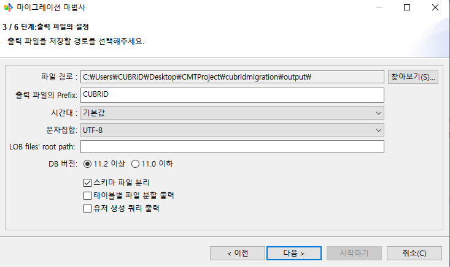

- 파일 경로: 출력되는 파일을 사용자가 원하는 위치로 지정할 수 있다. 기본 경로 설정은 CMT가 설치된 위치에 output 디렉토리 밑으로 지정되어 있다.

- 출력 파일의 Prefix: 출력되는 파일 이름 앞에 붙는 단어로, 원본 데이터베이스 연결 정보에 입력한 사용자 이름이 기본으로 설정된다.

- 시간대: 시간대를 설정

- 문자집합: 파일에 출력할 때 사용할 문자 코드를 지정한다.

- LOB files' root path: LOB 파일이 저장될 디렉토리를 지정한다.

- DB 버전: 11.2 이상을 선택 시 멀티 스키마가 적용된 파일로 출력이 되고, 11.0 이하를 선택 시 멀티 스키마가 적용되지 않은 파일로 출력된다.

- 스키마 파일 분리: 스키마 파일에는 table, view, serial, pk, fk, synonym, grant 오브젝트들이 출력되는데 이를 오브젝트 별로 별도의 파일에 저장하도록 설정할 수 있다.

- 테이블별 파일 분할 출력: 테이블의 data를 테이블 이름의 각각의 파일로 출력할 수 있다.

- 유저 생성 쿼리 출력: 원본 데이터베이스에 접속한 유저가 가지고 있는 권한 스키마들에 대해 유저를 생성할 수 있는 쿼리를 파일로 출력해준다.

**4단계 (스키마 맵핑)**
^^^^^^^^^^^^^^^^^^^^^^^^^^^^

마이그레이션 하고자 하는 스키마들을 선택한다. 온라인의 경우 드롭다운 리스트를 통해 대상 스키마를 선택할 수 있고, 오프라인의 경우 사용자가 직접 스키마 이름을 입력할 수 있다.

원본, 대상 데이터베이스 접속 유저 권한에 따라서 설정할 수 있는 대상 스키마가 달라진다.

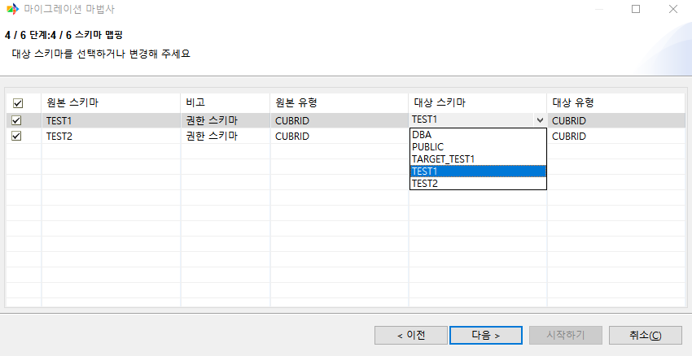

+----------------+------------------+------------------------------+------------------+-------------------------------------+
| 원본 \ 대상    | 11.0 일반 유저   | 11.0 DBA                     | 11.2 일반 유저   | 11.2 DBA                            |
+================+==================+==============================+==================+=====================================+
| 11.0 일반 유저 | target 접속 유저 | targetDB + souceDB명         | target 접속 유저 | target 모든 유저                    |
+----------------+------------------+------------------------------+------------------+-------------------------------------+
| 11.0 DBA       | target 접속 유저 | targetDB + souceDB명         | target 접속 유저 | target 모든 유저                    |
+----------------+------------------+------------------------------+------------------+-------------------------------------+
| 11.2 일반 유저 | target 접속 유저 | targetDB + souceDB 접속 유저 | target 접속 유저 | source 접속 유저 + target 모든 유저 |
+----------------+------------------+------------------------------+------------------+-------------------------------------+
| 11.2 DBA       | target 접속 유저 | targetDB + souceDB 모든 유저 | target 접속 유저 | source 접속 유저 + target 모든 유저 |
+----------------+------------------+------------------------------+------------------+-------------------------------------+

마이그레이션 마법사 3단계(출력 파일 설정)에서 설정한 DB 버전에 따라 대상스키마 입력 여부가 달라진다.

+-------------+------------------------------------+------------------+
| 원본 \ 대상 | 11.0 이하                          | 11.2 이상        |
+=============+====================================+==================+
| 11.0 이하   | 원본 스키마명으로 대상 스키마 고정 | 대상 스키마 입력 |
+-------------+------------------------------------+------------------+
| 11.2 이상   | 원본 스키마명으로 대상 스키마 고정 | 대상 스키마 입력 |
+-------------+------------------------------------+------------------+

**5단계 (객체 맵핑)**
^^^^^^^^^^^^^^^^^^^^^^^^^^^^^^

마이그레이션 할 객체들을 확인하고, 변경할 수 있는 단계이다. 확인할 수 있는 객체들은 table, pk, fk, index, view, serial, synonym, grant가 있다.

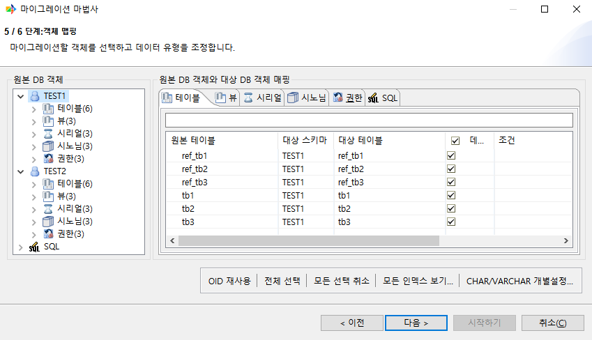

- Table
    - 원본 테이블, 대상 스키마, 대상 테이블에 대한 정보를 확인할 수 있다.

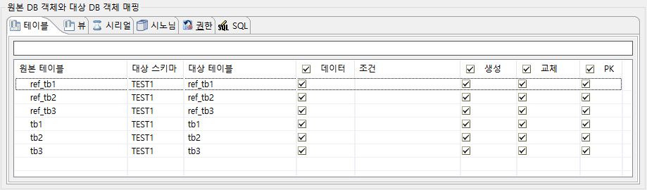

- 데이터: 테이블의 데이터(row)의 마이그레이션 여부를 선택할 수 있다. 선택하지 않으면 테이블 스키마만 마이그레이션 된다.

- 생성: 해당 테이블을 마이그레이션 대상에서 제외시킨다. 생성을 선택하지 않으면 다른 조건들도 선택할 수 없다.

- 교체: 대상 데이터베이스에 같은 이름의 테이블이 이미 생성되어 있는 경우 삭제하고 새로운 테이블을 생성한다.

- PK: 테이블의 PK를 생성 여부를 선택한다.

테이블 노드를 선택하면 해당 테이블에 컬럼 정보들을 확인할 수 있다.

.. image:: ./cmt_images/image76.png
   :width: 2.14722in
   :height: 1.88472in

.. image:: ./cmt_images/image77.png
   :width: 6.26805in
   :height: 3.65in

- 테이블 생성: 테이블을 마이그레이션 대상에서 제외시킨다. 테이블 생성을 체크하지 않으면 테이블 재생성, OID 재사용을 선택할 수 없다.

- 테이블 재생성: 대상 데이터베이스에 같은 이름의 테이블이 이미 생성되어 있는 경우 삭제하고 새로운 테이블을 생성한다.

- OID 재사용: 테이블 생성 시 REUSE_OID 옵션 사용 여부를 선택할 수 있다. REUSE_OID에 대한 자세한 내용은 를 참고하면 된다.

- 데이터 마이그레이션: 테이블의 데이터(row)의 마이그레이션 여부를 선택할 수 있다. 선택하지 않으면 테이블 스키마만 마이그레이션 된다.

PK (Primary key)
^^^^^^^^^^^^^^^^^^^^^^^^

테이블의 PK 정보를 확인할 수 있다. 대상 데이터베이스로 넘어가는 PK에 대한 이름을 변경할 수 있다. PK 컬럼과 아닌 컬럼을 확인할 수 있다.

PK 컬럼을 변경하고 한다면 PK가 아닌 컬럼에 있는 컬럼을 대상 PK 컬럼으로 옮기면 대상 PK 컬럼에 있는 컬럼들로 PK가 만들어진다.

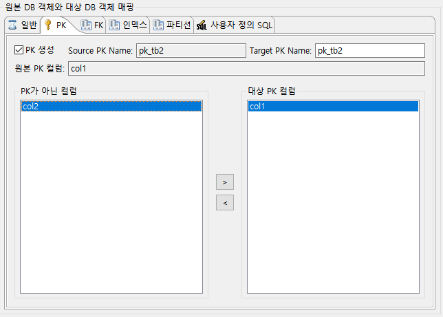

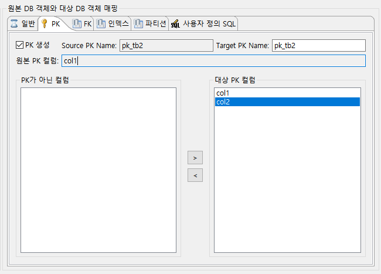

FK (Foreign key)
^^^^^^^^^^^^^^^^^^^^^^^^

테이블의 FK 이름과 설정들을 확인하고 변경할 수 있다.

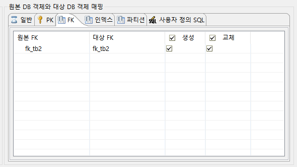

.. image:: ./cmt_images/image81.png
   :width: 6.26805in
   :height: 3.17639in

- 생성: 해당 FK를 마이그레이션 대상에서 제외시킨다. 생성을 선택하지 않으면 교체도 선택할 수 없다.

- 교체: 대상 데이터베이스에 같은 이름의 외래키가 이미 생성되어 있는 경우 삭제하고 새로운 외래키를 생성한다.

- 테이블 이름: FOREIGN KEY를 소유하고 있는 테이블의 이름이다.

- 외래키 이름: FOREIGN KEY 제약 조건의 이름을 지정한다.

- 외래 컬럼 정보: 외래키로 정의한 컬럼의 이름이다.

- 참조 테이블 이름: 참조되는 테이블의 이름이다.

- 참조 컬럼: 참조되는 기본키 컬럼 이름이다.

- On Update: 외래키가 참조하는 기본키 값을 갱신하려 할 때 수행할 작업을 정의한다. NO ACTION, RESTRICT, SET NULL 중 하나의 옵션을 선택할 수 있다.

- On Delete: 외래키가 참조하는 기본키 값을 삭제하려 할 때 수행할 작업을 정의한다. NO ACTION, RESTRICT, CASCADE, SET NULL 중 하나의 옵션을 선택할 수 있다.

Index
^^^^^^^^^^^^^^^^^^

테이블의 인덱스 설정들을 확인하고 변경할 수 있다.

.. image:: ./cmt_images/image82.png
   :width: 6.26805in
   :height: 2.7875in

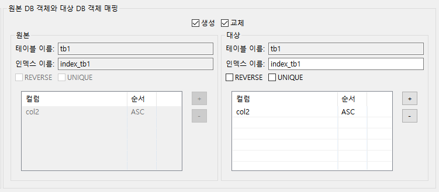

- 생성: 해당 Index를 마이그레이션 대상에서 제외시킨다. 생성을 선택하지 않으면 교체도 선택할 수 없다.

- 교체: 대상 데이터베이스에 같은 이름의 인덱스가 이미 생성되어 있는 경우 삭제하고 새로운 인덱스를 생성한다.

- 테이블 이름: 인덱스를 생성할 테이블의 이름이다.

- 인덱스 이름: 생성하려는 인덱스의 이름이다. 인덱스 이름은 테이블 안에서 고유한 값이어야 한다.

- REVERSE: Reverse Index로 생성한다.

- UNIQUE: 유일한 값을 갖는 고유 인덱스를 생성한다.

- 컬럼: 인덱스를 적용할 컬럼의 이름을 명시한다.

- 순서: 드롭다운 리스트로 ASC, DESC 중 하나를 선택하여 컬럼의 정렬 방향을 설정할 수 있다.

Column
^^^^^^^^^^^^^^^^^^

컬럼 노드를 선택하여 컬럼 세부 설정을 할 수 있다.

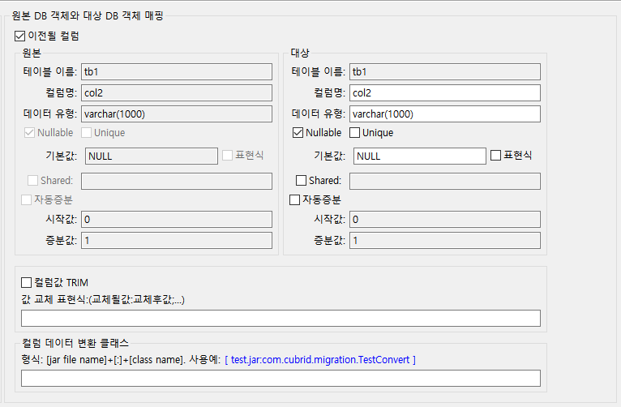

View
^^^^^^^^^^^^^^^^^^

원본 뷰, 대상 뷰 정보를 확인할 수 있다.

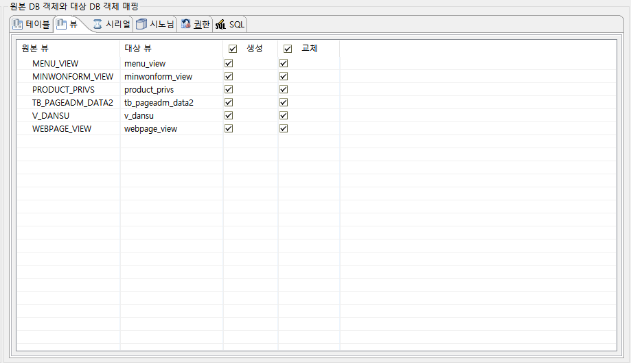

- 생성: 해당 뷰을 이관 대상에서 제외시킨다. 생성을 체크하지 않으면 교체를 선택할 수 없다.

- 교체: 대상 데이터베이스에 같은 이름의 뷰가 이미 생성되어 있는 경우 삭제하고 새로운 뷰 를 생성한다.

    - 뷰 상세 페이지를 통해 뷰 이름, View Query Spec을 변경할 수 있다.

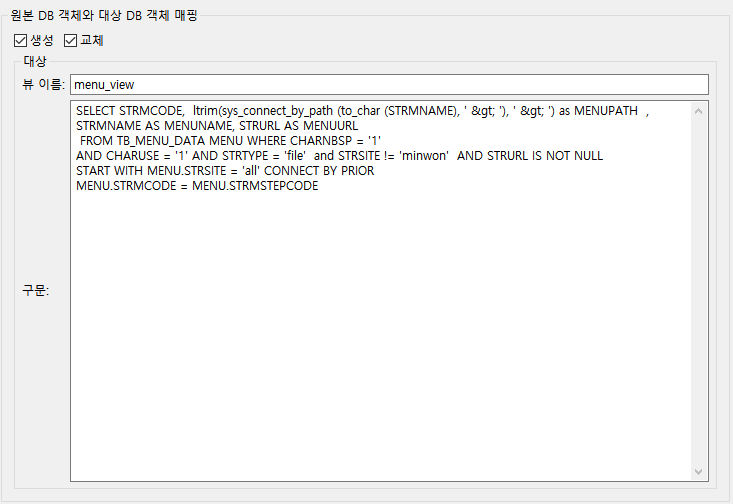

Serial
^^^^^^^^^^^^^^^^^^

원본 시리얼, 대상 시리얼 정보를 확인할 수 있다.

.. image:: ./cmt_images/image87.png
   :width: 6.26805in
   :height: 3.65278in

- 생성: 해당 시리얼을 이관 대상에서 제외시킨다. 생성을 체크하지 않으면 교체를 선택할 수 없다.

- 교체: 대상 데이터베이스에 같은 이름의 시리얼이 이미 생성되어 있는 경우 삭제하고 새로운 시리얼을 생성한다.

    - 시리얼 상세 페이지를 통해 이름, 시작 값, 증가 값, 최소 값, 최대 값, 캐시 값, 순환을 변경할 수 있다.

.. image:: ./cmt_images/image88.png
   :width: 6.02083in
   :height: 3.32361in

- 시리얼 이름: 시리얼의 이름을 지정한다.

- 시작 값: 처음 생성되는 시리얼 숫자를 지정한다.

- 증가 값: 시리얼 숫자 간의 간격을 지정한다.

- 최소 값: 시리얼의 최소값을 지정한다.

- 최대 값: 시리얼의 최대값을 지정한다.

- 캐시 값: cached_num 값을 지정한다.

- 순환: 시리얼 값이 최대 또는 최소값에 도달한 후에 연속적으로 값을 생성하도록 지정한다.

Synonym
^^^^^^^^^^^^^^^^^^

원본 시노님, 대상 시노님 정보를 확인할 수 있다.

.. image:: ./cmt_images/image89.png
   :width: 6.26805in
   :height: 3.64167in

- 생성: 해당 시노님을 이관 대상에서 제외시킨다. 생성을 체크하지 않으면 교체를 선택할 수 없다.

- 교체: 대상 데이터베이스에 같은 이름의 시노님이 이미 생성되어 있는 경우 삭제하고 새로운 시노님을 생성한다.

.. image:: ./cmt_images/image90.png
    :width: 6in
    :height: 2.75in

- 시노님 이름: 동의어의 이름을 지정한다.

- 시노님 스키마 이름: 동의어의 스키마 이름을 지정한다.

- 오브젝트 이름: 대상 객체의 이름을 지정한다.

- 오브젝트 스키마 이름: 대상 객체의 스키마 이름을 지정한다.

Grant
^^^^^^^^^^^^^^^^^^

권한 종류, 원본 스키마, 원본 오브젝트, 대상 스키마 정보를 확인할 수 있다.

.. image:: ./cmt_images/image91.png
   :width: 6.26805in
   :height: 3.65139in

생성: 해당 권한을 이관 대상에서 제외시킨다.

SQL
^^^^^^^^^^^^^^^^^^
사용자가 쿼리를 통해 원하는 record, table을 대상에 출력할 수 있다.

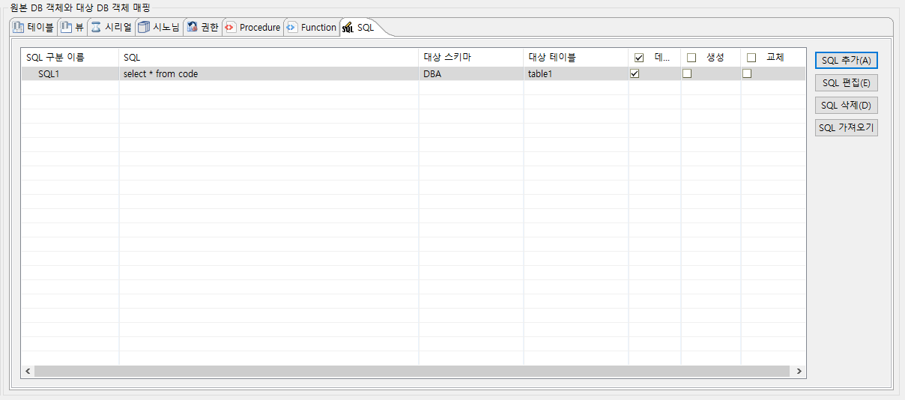

- SQL 추가: 쿼리를 입력하는 창을 표시하여 원하는 쿼리를 입력할 수 있다

- SQL 편집: 입력된 쿼리를 편집할 수 있다

- SQL 삭제: 입력된 쿼리를 삭제할 수 있다

- SQL 가져오기: SQL 파일을 선택하여 쿼리를 가져올 수 있다

- 데이터: 입력한 쿼리를 통해 record 추출 여부를 확인한다

- 생성: 입력한 쿼리를 통해 "대상 테이블" 이름을 가지는 테이블을 생성한다

- 교체: 이미 "대상 테이블" 이름을 가진 테이블이 있을 경우 해당 테이블을 교체한다

**6단계**
^^^^^^^^^^^^^^^^^
마이그레이션을 실행하기 전 설정한 정보들을 확인할 수 있다.

.. image:: ./cmt_images/image92.png
   :width: 6.26805in
   :height: 5.05556in

고급 성능 설정

.. image:: ./cmt_images/image93.png
   :width: 5.53056in
   :height: 2.28194in

- 동시 작업 개수: 마이그레이션 시 사용할 스레드 개수를 지정할 수 있다.

- 커밋 주기: 대량의 데이터를 가져오기 할 경우 데이터베이스에 트랜잭션이 길어지고 변경로그가 쌓이게 되면, 데이터베이스 입력이 느려지기 때문에 주기적으로 커밋하는 것을 권한다. 1000으로 기본 설정되어 있으며, 환경에 따라 그 이상의 값을 설정할 수 있다.

- 테이블별 진행율 생략: 마이그레이션 시 실시간으로 테이블별 row 진행 정도를 생략하면서 마이그레이션을 수행할 수 있다.

DDL 미리보기
^^^^^^^^^^^^^^^^^^

이관 대상의 오브젝트의 DDL을 확인해 볼 수 있다.

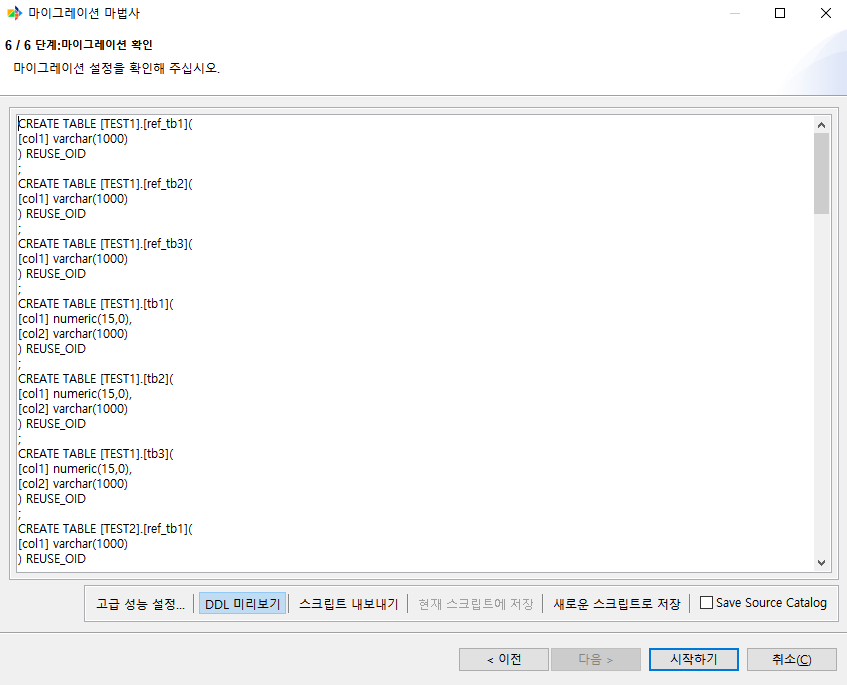

스크립트 내보내기
^^^^^^^^^^^^^^^^^^

- 마이그레이션 마법사에서 설정한 정보를 스크립트 파일로 내보낼 수 있다. 로컬 PC로 내보내거나, 원격 서버로 내보낼 수 있다.

- 현재 스크립트에 저장: 마이그레이션 작업이 스크립트로 실행되었거나, 스크립트로 저장된 작업이라면 마이그레이션 마법사 설정을 하면서 변경한 정보를 현재 스크립트에 덮어서 저장할 수 있다.

- 새로운 스크립트로 저장: 마이그레이션 마법사에서 설정한 정보를 스크립트로 저장할 수 있다.

Save Source Catalog

**마이그레이션 실행**
^^^^^^^^^^^^^^^^^^^^^^^^^^

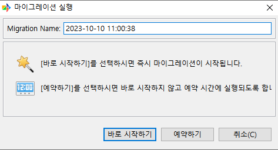

- 바로 시작하기: 즉시 마이그레이션이 시작된다.

- 예약하기: 바로 마이그레이션이 시작되지 않고 사용자가 예약한 시간에 실행된다.

- 마이그레이션 예약 설정: 마이그레이션 예약 설정을 할 수 있다.

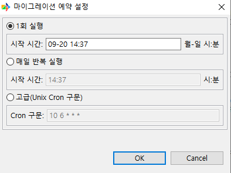

- 1회 실행: 사용자가 설정한 시간에 한 번만 마이그레이션이 실행된다.

- 매일 반복 실행: 사용자가 설정한 시간에 매일 반복해서 마이그레이션이 실행된다.

마이그레이션 보고서
--------------------

**저장**
^^^^^^^^^^^^^^^^^^

.. image:: ./cmt_images/image97.png
   :width: 6.26805in
   :height: 1.50278in

저장 아이콘을 클릭해 마이그레이션 보고서를 로컬 PC에 저장할 수 있다.

**마이그레이션 재실행**
^^^^^^^^^^^^^^^^^^^^^^^^^^^

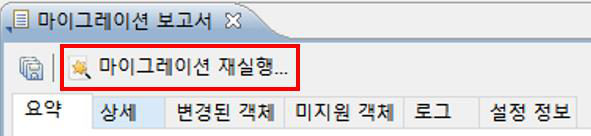

수행했던 마이그레이션을 바로 재실행 한다.

**요약**
^^^^^^^^^^^

.. image:: ./cmt_images/image99.png
   :width: 6.26805in
   :height: 3.4375in

마이그레이션 한 오브젝트들을 원본 데이터베이스에서 가져온 개수와 대상
데이터베이스로 마이그레이션 된 오브젝트들을 확인할 수 있다.

**상세**
^^^^^^^^^^^

.. image:: ./cmt_images/image100.png
   :width: 6.26805in
   :height: 4.12639in

마이그레이션 한 오브젝트들의 유형, 이름, DDL을 확인할 수 있다. 

**변경된 객체**
^^^^^^^^^^^^^^^^^^^^

.. image:: ./cmt_images/image101.png
   :width: 6.26805in
   :height: 2.73194in

이름이 변경된 오브젝트들을 확인할 수 있다. schema, table, view, serial, synonym 만 지원한다. 

**미지원 객체**
^^^^^^^^^^^^^^^^^^^^^^^^^

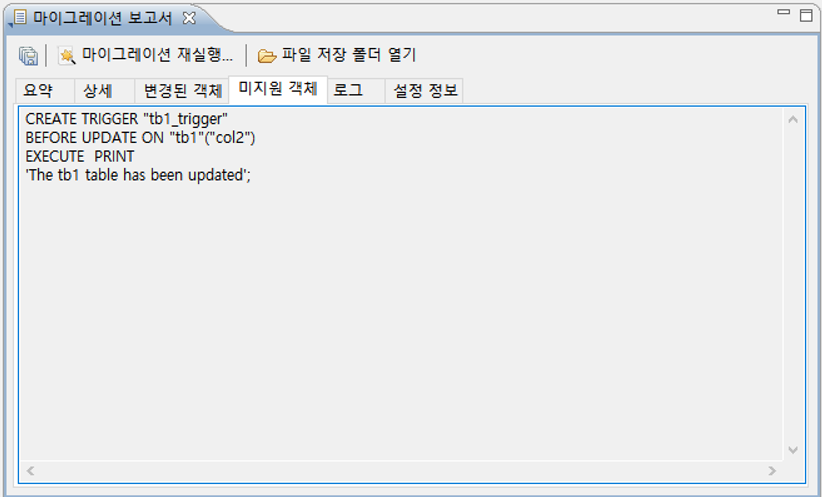

마이그레이션을 지원하지 않는 오브젝트들의 DDL을 확인할 수 있다. 함수, 트리거, 프로시저는 지원하지 않는다. Grant의 경우 온라인 이관 시 대상 데이터베이스 연결 유저가 DBA 또는 DBA 권한이 없을 시 마이그레이션을 지원하지 않는다.

**로그**
^^^^^^^^^^^^^^^^^^^^^^^^^

.. image:: ./cmt_images/image103.png
   :width: 6.26805in
   :height: 4.12083in

오브젝트 생성 시간, DDL과 성공 여부를 확인할 수 있다.

**설정 정보**
^^^^^^^^^^^^^^^^^^^^^^^^^

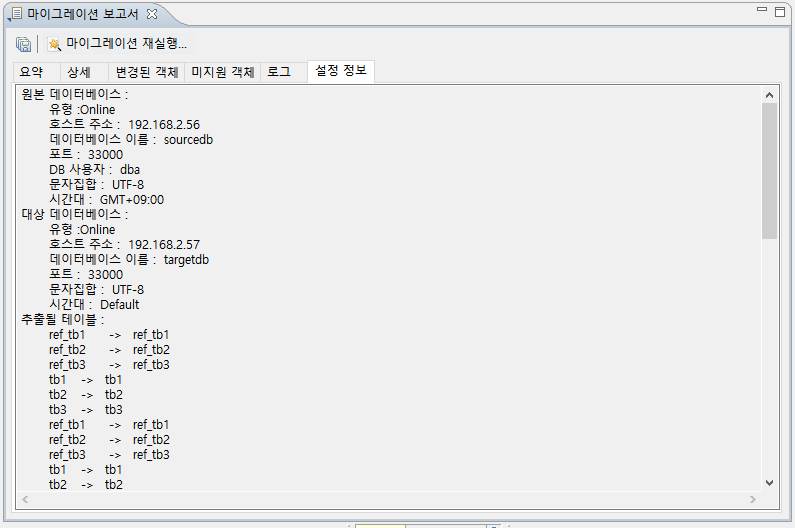

마이그레이션 마법사 Step 6에서 확인한 최종 정보를 확인할 수 있다.

마이그레이션 시나리오
----------------------

.. image:: ./cmt_images/image105.png
   :width: 6.26805in
   :height: 7.36944in

운영 중인 CUBRID 데이터베이스에 원격 접속하여 마이그레이션 수행(시나리오 1)
CUBRID 데이터베이스에 로컬 PC로 dump 파일로 마이그레이션 수행(시나리오 2)

시나리오 1
^^^^^^^^^^^^^^^^^^

**A. 새 마이그레이션**

새로운 마이그레이션 작업을 수행하기 위해 좌측 상단에 있는 [새 마이그레이션]을 클릭하여 마이그레이션 마법사를 실행한다.

.. image:: ./cmt_images/image106.png
    :width: 6.26805in
    :height: 4.75556in

**B. 마이그레이션 유형 선택**

원본 유형은 [온라인 CUBRID 데이터베이스], 대상 유형도 [온라인 CUBRID 데이터베이스]를 선택한다.

.. image:: ./cmt_images/image107.png
    :width: 6.26805in
    :height: 5.04306in

**C. 원본 온라인 데이터베이스 선택**

스키마 정보와 데이터를 가져올 원본 데이터베이스를 선택한다.

저장되어 있는 연결 정보가 있다면 선택만 하면 되고, 연결 정보가 없으면 [신규]를 클릭해 연결 정보를 저장 후 선택하면 된다.

.. image:: ./cmt_images/image108.png
    :width: 6.26805in
    :height: 5.07639in

**D. 대상 온라인 데이터베이스 선택**

원본 데이터베이스에서 가져온 정보를 이관할 대상 데이터베이스를선택한다.

저장되어 있는 연결 정보가 있다면 선택만 하면 되고, 연결 정보가 없다면 [신규]를 클릭해 연결 정보를 저장 후 선택하면 된다.

.. image:: ./cmt_images/image109.png
    :width: 6.26805in
    :height: 5.08194in

**E. 이관 스키마 선택**

이관하고자 하는 스키마를 선택할 수 있다. 원본 데이터베이스와 대상 데이터베이스 연결 유저에 따라서 대상 스키마를 변경할 수도 있다.

.. image:: ./cmt_images/image110.png
    :width: 6.26805in
    :height: 5.06528in

**F. 오브젝트 설정 및 확인**

원본 데이터베이스에서 가져온 오브젝트들을 확인하고 변경할 수 있다.

.. image:: ./cmt_images/image111.png
    :width: 6.26805in
    :height: 5.04167in

**G. 마이그레이션 전 최종 확인**

마이그레이션 전 설정한 내용에 대한 최종 확인을 할 수 있다.

우측 하단에 [시작하기]를 클릭하면 마이그레이션이 시작된다.

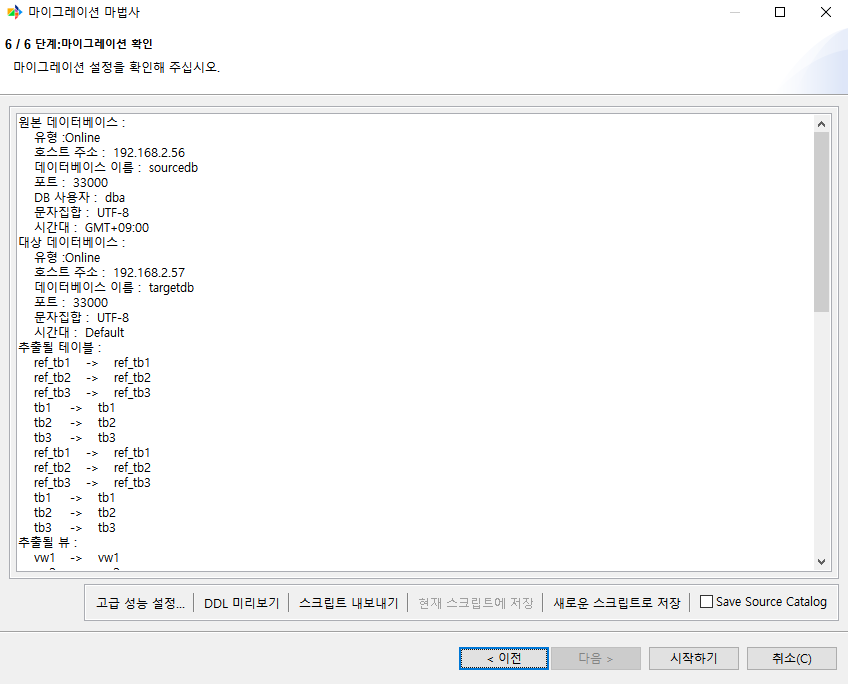

**H. 마이그레이션 진행**

마이그레이션이 진행되고 있는 상황을 실시간으로 확인할 수 있다.

위 표에는 각 테이블에 있는 레코드들의 진행 상황을 확인할 수 있고, 아래 로그는 현재 수행되고 있는 오브젝트를 확인할 수 있다.

로그는 마이그레이션이 끝난 뒤 마이그레이션 보고서에서 다시 확인할 수 있다.

.. image:: ./cmt_images/image113.png
    :width: 6.26805in
    :height: 4.39028in

**I. 마이그레이션 보고서 확인**

마이그레이션 작업이 끝난 뒤 결과를 보고서로 확인할 수 있다.

.. image:: ./cmt_images/image114.png
    :width: 6.26805in
    :height: 4.40972in

시나리오 2
^^^^^^^^^^^^^^^^^^

**A. 새 마이그레이션**

새로운 마이그레이션 작업을 수행하기 위해 좌측 상단에 있는 [새 마이그레이션]을 클릭하여 마이그레이션 마법사를 실행한다.

.. image:: ./cmt_images/image106.png
    :width: 6.26805in
    :height: 4.75556in

**B. 마이그레이션 유형 선택**

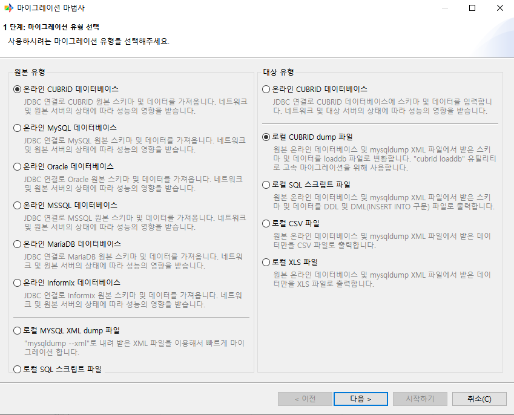

**C. 원본 온라인 데이터베이스 선택**

스키마 정보와 데이터를 가져올 원본 데이터베이스를 선택한다.

저장되어 있는 연결 정보가 있다면 선택만 하면 되고, 연결 정보가 없으면 [신규]를 클릭해 연결 정보를 저장 후 선택하면 된다.

.. image:: ./cmt_images/image108.png
    :width: 6.26805in
    :height: 5.07639in

**D. 출력 파일 설정**

출력 파일을 저장할 경로를 설정하거나, DB 버전, 스키마 파일 분리 여부와 같은 기능들을 선택할 수 있다.

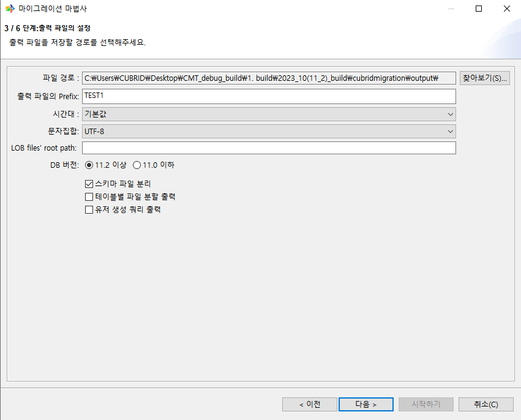

**E. 이관 스키마 선택**

이관하고자 하는 스키마를 선택할 수 있다. 오프라인 이관의 경우 대상 데이터베이스 접속 유저에 따라 대상 스키마의 이름을 직접 지정해야 한다.

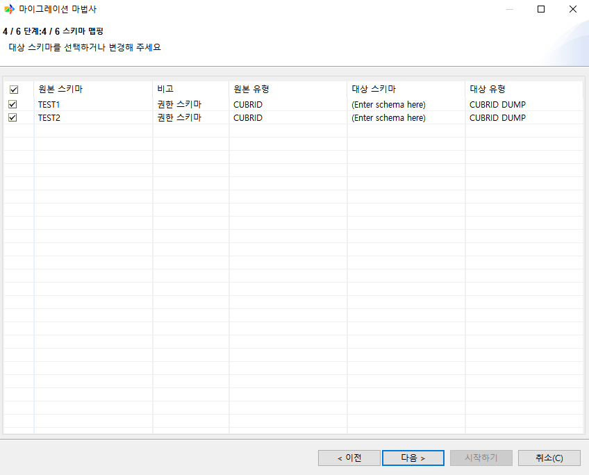

**F. 오브젝트 설정 및 확인**

원본 데이터베이스에서 가져온 오브젝트들을 확인하고 변경할 수 있다.

.. image:: ./cmt_images/image118.png
    :width: 6.26805in
    :height: 5.05278in

**G. 마이그레이션 전 최종 확인**

마이그레이션 전 설정한 내용에 대한 최종 확인을 할 수 있다.

우측 하단에 [시작하기]를 클릭하면 마이그레이션이 시작된다.

.. image:: ./cmt_images/image119.png
    :width: 6.26805in
    :height: 5.04028in

**H. 마이그레이션 진행**

마이그레이션이 진행되고 있는 상황을 실시간으로 확인할 수 있다.

위 표에는 각 테이블에 있는 레코드들의 진행 상황을 확인할 수 있고, 아래 로그는 현재 수행되고 있는 오브젝트를 확인할 수 있다.

로그는 마이그레이션이 끝난 뒤 마이그레이션 보고서에서 다시 확인할 수 있다.

.. image:: ./cmt_images/image120.png
    :width: 6.26805in
    :height: 4.41528in

**I. 마이그레이션 보고서 확인**

마이그레이션 작업이 끝난 뒤 결과를 보고서로 확인할 수 있다.

.. image:: ./cmt_images/image121.png
    :width: 6.26805in
    :height: 4.41806in

