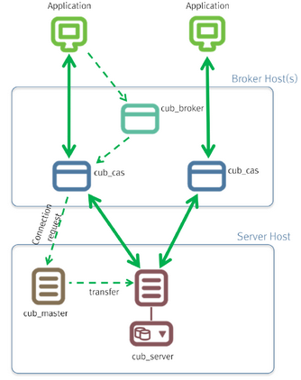

***********
CUBRID 소개
***********

CUBRID의 구조 및 특징을 설명한다. 
CUBRID는 객체 관계형 데이터베이스 관리 시스템으로서, 데이터베이스 서버, 브로커, CUBRID 매니저로 구성된다. 
CUBRID는 인터넷 데이터 서비스에 최적화된 데이터베이스 시스템이며, 사용자가 편리하게 사용할 수 있는 다양한 기능을 제공한다.

이 장에서 설명하는 주요 내용은 다음과 같다.

*   시스템 구조: 데이터베이스 볼륨 구조, 서버 프로세스, 브로커 프로세스, 인터페이스 모듈에 대해 설명한다.

*   CUBRID의 특징: CUBRID의 트랜잭션, 백업 및 복구, 파티션, 인덱스 기능, HA 기능, Java 저장 프로시저, 클릭 카운터, 관계형 데이터 모델 확장에 대해 간단히 설명한다.

시스템 구조
===========

시스템 구성
-----------

CUBRID는 객체 관계형 데이터베이스 관리 시스템으로서, 데이터베이스 서버, 브로커, CUBRID 매니저로 구성된다.

*   데이터베이스 서버는 CUBRID 데이터베이스 관리 시스템의 핵심 구성 요소로 데이터 저장 및 관리 기능을 수행하며, 멀티스레드 기반 클라이언트/서버 방식으로 동작한다. 데이터베이스 서버는 사용자가 입력한 질의를 처리하고, 데이터베이스 내의 객체를 관리한다. CUBRID 데이터베이스 서버는 잠금 기법과 로깅 기법을 이용해 다수 사용자가 동시에 사용하는 환경에서도 완벽한 트랜잭션을 지원하며, 운영에 필요한 데이터베이스 백업과 복구 기능을 지원한다.

*   브로커는 서버와 외부 응용 프로그램 간의 통신을 중계하는 CUBRID 전용 미들웨어로서, 커넥션 풀링, 모니터링, 로그 추적 및 분석 기능을 제공한다.

*   CUBRID 매니저는 데이터베이스와 브로커를 원격에서 관리할 수 있는 GUI 툴이다. 또한, CUBRID 매니저는 사용자가 데이터베이스 서버에 SQL 질의를 수행할 수 있는 편리한 기능의 질의 편집기를 제공한다. CUBRID 매니저에 대한 자세한 내용은   `http://www.cubrid.org/wiki_tools/entry/cubrid-manager <http://www.cubrid.org/wiki_tools/entry/cubrid-manager>`_ 를 참조한다.

.. note:: 
	CUBRID 쿼리 브라우저는 CUBRID 매니저의 기능을 경량화한 도구로, 응용 개발자에게 필수 기능인 데이터베이스 관리 기능과 질의 편집기 기능만을 제공한다. CUBRID 쿼리 브라우저에 대한 자세한 내용은 `http://www.cubrid.org/wiki_tools/entry/cubrid-query-browser <http://www.cubrid.org/wiki_tools/entry/cubrid-query-browser>`_ 를 참고한다.

데이터베이스 볼륨 구조
----------------------

아래 그림은 CUBRID 데이터베이스 볼륨의 구조를 도식화한 구성도이다. 데이터베이스 볼륨을 크게 영구 볼륨, 임시 볼륨, 백업 볼륨으로 분류하고, 아래 구성도를 참고하여 각각에 속하는 볼륨 및 특징을 살펴보기로 한다.

**영구적 볼륨(Permanent Volume)**

영구적 볼륨은 한번 생성되면 영구적으로 존재하는 데이터베이스 볼륨으로서, 볼륨 타입으로는 범용(generic), 데이터(data), 임시(temp), 인덱스(index), 제어(control), 활성 로그(active log), 보관 로그(archive log)가 있다.

**범용 볼륨(Generic Volume)**

사용자는 데이터베이스에 추가할 볼륨 타입을 데이터(data), 임시(temp), 인덱스(index) 중 하나의 용도로 지정하여 효율적으로 관리할 수 있는데, 별도로 데이터 용도를 지정하지 않는 경우에는 범용(generic) 볼륨으로 지정된다.

**데이터 볼륨(Data Volume)**

데이터 볼륨은 인스턴스, 테이블, 멀티미디어 데이터 등과 같은 데이터를 저장하기 위한 공간이다.

**임시 볼륨(Temp Volume)**

임시 볼륨은 질의 처리 및 정렬(sorting)을 수행할 때 중간, 최종 결과를 임시로 저장하는 공간으로, 아래에서 설명할 일시적 임시 볼륨과 구분하기 위해 영구적 임시 볼륨이라고도 한다. 임시 볼륨은 영구적으로 확보한 공간으로, 해당 공간에 존재하는 데이터가 임시적으로 저장 및 소멸되는 것을 의미한다. 따라서 CUBRID를 재시작하면 임시 볼륨 공간 내의 데이터는 초기화되고, 이에 관련된 로그 정보는 남지 않는다.

영구적 또는 임시적 임시 볼륨을 사용할 수 있는 질의의 예는 다음과 같다.

*   **SELECT** 문 등 질의 결과가 생성되는 질의

*   **GROUP BY** 나 **ORDER BY** 가 포함된 질의

*   부질의(subquery)가 포함된 질의

*   정렬 병합(sort-merge) 조인이 수행되는 질의

*   **CREATE INDEX** 문이 포함된 질의

위와 같은 질의를 수행할 때 **SELECT** 결과를 저장하거나 데이터를 정렬하기 위해 지정한 메모리 공간 (**cubrid.conf** 에서 지정하는 시스템 파라미터인**temp_file_memory_size_in_pages** 에 의해 메모리 공간의 크기가 결정됨)을 소진하면 임시 볼륨 공간을 사용한다. 질의 처리 및 정렬 결과를 저장하기 위해 사용하는 저장 공간의 순서는 다음과 같으며, 앞의 저장 공간을 모두 소진하면 뒤의 저장 공간을 사용한다.

*   **temp_file_memory_size_in_pages** 시스템 파라미터에 의해 확보된 메모리

*   영구적 임시 볼륨

*   일시적 임시 볼륨(자세한 내용은 아래에서 설명한다.)

**인덱스 볼륨(Index Volume)**

인덱스 볼륨은 신속한 질의 처리 또는 무결성 제약 조건(integrity constraints) 검증을 위한 인덱스 정보를 유지하는 공간이다.

**제어 파일(Control File)**

제어 파일은 데이터베이스 내 존재하는 볼륨의 정보, 백업 정보 및 로그의 정보를 저장하는 파일이다.

*   **볼륨 정보**
    : 데이터베이스 내 모든 볼륨의 이름과 위치, 그리고 내부 볼륨 식별자를 포함하는 정보로서, 데이터베이스가 재시작될 때 CUBRID는 볼륨 정보 제어 파일을 판독하며, 새로운 데이터베이스 볼륨이 추가될 때에 새로운 엔트리를 볼륨 정보 제어 파일에 기록한다.

*   **백업 정보**
    : 정보 볼륨에 대한 모든 백업의 위치는 백업 정보 제어 파일에 기록된다. 이 제어 파일은 로그 파일이 관리되는 곳에 유지된다.

*   **로그 정보**
    : 모든 활성 로그와 보관 로그의 이름을 포함하며, 사용자는 로그 정보 제어 파일을 통해 보관 로그의 정보를 확인할 수 있다. 이러한 로그 정보 제어 파일은 로그 파일과 동일한 위치에서 생성 및 관리된다.

이와 같이 각각의 제어 파일은 데이터베이스 볼륨의 위치, 백업 정보, 로그 정보를 포함하며, 데이터베이스가 재시작하면서 읽는 파일이므로 사용자 임의로 변경해서는 안 된다.

**활성 로그(Active Log)**

활성 로그(active log)는 데이터베이스의 최근 변경 사항을 포함하는 로그이며, 데이터베이스에 문제가 발생하는 경우 활성 로그 및 보관 로그를 이용하여 고장 발생 전의 커밋된 시점으로 완전하게 데이터베이스를 복구할 수 있다.

**보관 로그(Archive Log)**

보관 로그는 최근의 변경 사항을 포함하고 있는 활성 로그(active log) 공간이 모두 사용된 후에 지속적으로 생성되는 로그를 보관하기 위한 볼륨이다. 시스템 파라미터 **log_max_archives** 의 값이 0보다 크게 설정된 경우 활성 로그 볼륨의 공간이 소진된 후에 보관 로그 볼륨이 추가된다. 제품 설치 시에는 0으로 설정되어 있다. 보관 로그 볼륨은 **log_max_archives** 의 설정 값만큼 볼륨 파일이 유지된다. 디스크 공간 확보를 위해 불필요한 보관 로그는 시스템의 설정에 의해 삭제되어야 하지만, 데이터베이스 복구에 사용하려면 이 값을 적절하게 설정해야 한다. 이에 대한 자세한 내용은 `보관 로그 관리 <#admin_admin_br_arlogfile_htm>`_ 를 참고한다.

**백그라운드 보관 로그(Background Archive Log)**

백그라운드 보관 로그(background archive log)는 백그라운드에서 로그 보관 작업(log archiving)을 수행할 때 사용하는 볼륨이다.

**일시적 볼륨(Temporary Volume)**

일시적 볼륨이란, 영구적 볼륨과 반대되는 의미이다. 즉, 사용자가 영구적 볼륨으로 지정한 공간을 초과하여 데이터가 축적되는 경우에만 일시적으로 마련되는 저장 공간을 일시적 볼륨이라 하며, 이는 서버 프로세스가 종료됨에 따라 소멸된다. 이처럼 일시적으로 생성 및 소멸되는 볼륨으로는 일시적 임시 볼륨(temporary temp volume)이 있다.

**일시적 임시 볼륨(Temporary Temp Volume)**

영구적 볼륨에 속하는 임시 볼륨은 영구적으로 공간을 확보하는 볼륨인 데 비해, 일시적 임시 볼륨(temporary temp volume)은 영구적 임시 볼륨(permanent temp volume)으로 지정된 공간 외에 추가 공간이 필요한 경우 시스템이 일시적으로 생성하는 임시 볼륨이다. 일시적 임시 볼륨을 생성하는 비용은 상당히 크기 때문에 **DBA** 는 데이터베이스 운영 상황을 고려하여 적절한 크기의 영구적 임시 볼륨을 추가하는 것이 성능상 유리하다.

데이터베이스 생성 시에 **DBA** 는 일시적 임시 볼륨이 생성될 수 있는 공간도 감안해야 한다. 일시적 임시 볼륨은 한 번 생성되면 데이터베이스를 재시작하기 전까지 유지되며, 한 번 늘어난 크기는 줄어들지 않는다. 일시적 임시 볼륨의 크기가 지나치게 커지면, 데이터베이스를 재시작하여 일시적 임시볼륨이 자동으로 삭제되도록 하는 것이 좋다. 일시적 임시 볼륨을 수동으로 삭제해서는 안 된다.

*   **일시적 임시 볼륨의 파일명**: CUBRID의 일시적 임시 볼륨의 파일명은 *db_name***_t***num* 형식의 이름을 갖는다. 여기서 *db_name* 은 데이터베이스 이름이고, *num* 은 볼륨 식별자이다. 볼륨 식별자는 32766에서부터 1씩 감소한다.

*   **일시적 임시 볼륨의 크기 설정** : 일시적 임시 볼륨이 생성되는 개수는 트랜잭션 처리에 필요한 공간의 크기에 따라 시스템이 결정한다. 	그러나, 일시적 임시 볼륨의 크기는 사용자가 시스템 파라미터 설정 파일(**cubrid.conf**)의 **temp_file_max_size_in_pages** 파라미터의 값을 설정함으로써 제한할 수 있다. 이 파라미터의 기본값은 **-1** 로, 여유 공간이 있는 한 최대한 생성할 수 있다. 0으로 설정되면 영구적 임시 볼륨이 소진되어도 일시적 임시 볼륨을 생성하지 않는다.

*   **일시적 임시 볼륨의 저장 위치 설정**: 일시적 임시 볼륨은 기본적으로 첫 번째 데이터베이스 볼륨이 생성된 위치에 만들어진다. 
	그러나, 사용자가 **temp_volume_path** 파라미터 값을 설정하여 일시적 임시 볼륨이 저장될 다른?디렉터리를 지정할 수 있다.

*   **일시적 임시 볼륨의 삭제**: 일시적 임시 볼륨은 데이터베이스가 구동 중일 때만 일시적으로 존재하며, 서버가 운영 중일 때 일시적 임시 볼륨을 임의로 삭제하면 안 된다. 데이터베이스 서버가 정상적으로 종료되면 일시적 임시 볼륨이 삭제되고, 데이터베이스 서버가 비정상적으로 종료되면 서버가 재시작할 때 일시적 임시 볼륨이 삭제된다.

**백업 볼륨**

백업 볼륨은 데이터베이스에 대한 스냅샷으로서, 이러한 백업 볼륨과 로그 볼륨을 기반으로 특정 시점까지 발생한 트랜잭션을 복구할 수 있다.

사용자는 **cubrid backupdb** 유틸리티를 통해 데이터베이스 복구를 위해 필요한 모든 데이터를 복사할 수 있으며, 데이터베이스 환경 설정 파일(
**cubrid.conf**)의 **backup_volume_max_size_bytes** 파라미터 값을 설정하여 백업 볼륨의 분할 크기를 조정할 수 있다.

데이터베이스 서버
-----------------

**DB 서버 프로세스**

각 데이터베이스에는 한 개의 서버 프로세스가 존재한다. 서버 프로세스는 CUBRID 데이터베이스 서버를 구성하는 핵심 프로세스로 데이터베이스 파일 및 로그 파일 등에 직접 접근하여, 사용자의 요청을 처리한다. 클라이언트 프로세스는 서버 프로세스와 TCP/IP 통신을 통해 접속하며, 하나의 서버 프로세스는 스레드를 생성해서 다수의 클라이언트 프로세스의 요청 작업을 처리한다. 데이터베이스별, 즉 서버 프로세스별로 시스템 파라미터 설정을 지정할 수 있으며 서버 프로세스는 **max_clients** 파라미터 값으로 지정된 수만큼 클라이언트 프로세스의 접속이 가능하다.

**마스터 프로세스**

마스터 프로세스는 클라이언트 프로세스가 서버 프로세스에 접속하여 통신할 수 있게 하는 중개 프로세스로서, 호스트별로 한 개씩 동작한다. (정확히는 시스템 파라미터 파일인 **cubrid.conf** 에 지정되는 접속 포트 번호별로 하나씩의 마스터 프로세스가 존재한다.) 마스터 프로세스는 지정된 TCP/IP 포트에 대기하고 있고, 클라이언트 프로세스는 해당 TCP/IP 포트로 마스터 프로세스에 접속한 후 마스터 프로세스가 지정된 데이터베이스 이름에 따라 해당 서버 프로세스로 소켓 포트를 변경하여 접속을 처리한다.

**실행 모드**

서버 프로세스를 제외한 CUBRID의 프로그램들은 종류에 따라 두 가지 실행 모드가 있다. 실행 모드는 클라이언트/서버 모드(client/server mode)와 독립 모드(standalone mode)로 나뉜다.

*   클라이언트/서버 모드는 해당 프로그램이 클라이언트 프로세스로서 동작하여 서버 프로세스에 접속하는 방식이다.

*   독립 모드는 해당 프로그램이 서버 프로세스의 기능을 포함하고 있어 직접 데이터베이스 파일에 접근하여 수행하는 방식이다.

예를 들어, 데이터베이스 생성 유틸리티나 복구 유틸리티 등은 다수 사용자가 데이터베이스에 접근하는 것을 막고 해당 프로그램만이 온전히 점유해서 작업할 수 있도록 독립 모드로 실행된다. 또 다른 예로, CSQL 인터프리터는 클라이언트/서버 모드로 동작하여 서버 프로세스에 접속할 수도 있고, 독립 모드로 동작하여 데이터베이스에 접근하여 SQL 문을 실행할 수도 있다. 참고로, 하나의 데이터베이스에 서버 프로세스와 독립 모드로 실행되는 프로그램이 동시에 접근할 수는 없다.

브로커
------

브로커는 다양한 응용 클라이언트가 데이터베이스 서버에 연결할 수 있도록 중계하는 미들웨어이다. 브로커를 포함하는 큐브리드 시스템은 아래 그림과 같이, 응용 클라이언트(application), cub_broker, cub_cas, 데이터베이스 서버(cub_server)를 포함한 다중 계층 구조를 가진다.

**응용 클라이언트**

응용 클라이언트에서 사용할 수 있는 인터페이스는 C-API(CCI, CUBRID Call Interface), ODBC, JDBC, PHP, Tcl/Tk, Python, Ruby, OLEDB, ADO.NET 등이 있다.

**cub_cas**

cub_cas(CUBRID Common Application Server, 브로커 응용 서버, 또는 줄여서 응용 서버, CAS라고도 함)는 연결을 요청하는 모든 종류의 응용 클라이언트가 사용하는 공용 응용 서버 역할을 한다. 또한, cub_cas는 데이터베이스 서버의 클라이언트로 동작하여 클라이언트의 요청에 의해 데이터베이스 서버와 연결을 제공한다. 서비스 풀(service pool) 내에서 구동되는 cub_cas의 개수는 **cubrid_broker.conf** 설정 파일에 지정할 수 있으며, cub_broker에 의해 동적으로 조정된다.

cub_cas는 CUBRID 데이터베이스 서버의 클라이언트 라이브러리와 링크되는 프로그램으로 데이터베이스 서버 프로세스(cub_server)에는 클라이언트 모듈로 동작하며, 쿼리 파싱이나 최적화, 실행 계획 생성 등의 작업이 클라이언트 모듈에서 수행된다.

**cub_broker**

cub_broker는 응용 클라이언트와 cub_cas 사이의 연결을 중계하는 기능을 수행한다. 즉, 응용 클라이언트가 접근을 요청하면, cub_broker는 공유 메모리(shared memory)를 통해 cub_cas의 상태를 파악하여 접근 가능한 cub_cas에게 요청을 전달하고, 해당 cub_cas로부터 전달 받은 요청에 대한 처리 결과를 응용 클라이언트에게 반환한다.

또한, cub_broker는 서비스 풀 내의 cub_cas 개수를 조정하여 서버 부하를 관리하고, cub_cas의 구동 상태를 모니터링 및 관리한다. 만약, 응용 클라이언트의 요청을 cub_cas 1에게 전달하였는데, 비정상적인 종료로 인해 cub_cas 1과의 연결이 실패하면, cub_broker는 응용 클라이언트에게 연결 실패에 관한 에러 메시지를 전송하고 cub_cas 1을 재구동한다. 새롭게 구동된 cub_cas 1은 정상적인 대기 상태가 되어, 새로운 응용 클라이언트의 요청에 의해 재연결된다.

**공유 메모리**

공유 메모리에는 cub_cas의 상태 정보가 저장되며, cub_broker는 공유 메모리에 저장된 cub_cas의 상태 정보를 참조하여 응용 클라이언트와의 연결을 중계한다. 공유 메모리에 저장된 cub_cas의 상태 정보를 통해 시스템 관리자는 어떤 cub_cas가 현재 작업을 수행중인지, 어떤 응용 클라이언트의 요청이 처리 중인지를 확인할 수 있다.

인터페이스 모듈
---------------

CUBRID는 다양한 응용 프로그래밍 인터페이스(API : Application Programming Interface)를 제공한다. 지원되는 API는 다음과 같다.

*   JDBC : Java 환경에서 데이터베이스 응용 프로그램을 작성하는 표준 API

*   ODBC : Windows 환경에서 데이터베이스 응용 프로그램을 작성하는 표준 API. ODBC 드라이버는 CCI 라이브러리를 기반으로 작성되었다.

*   OLE DB : Windows 환경에서 COM 방식으로 데이터베이스 응용 프로그램을 작성하는 API. OLE DB 프로바이더는 CCI 라이브러리를 기반으로 작성되었다.

*   PHP : PHP 환경에서 데이터베이스 응용 프로그램을 작성하는 API. PHP 드라이버는 CCI 라이브러리를 기반으로 작성되었다.

*   CCI : CUBRID에서 제공하는 C 언어 인터페이스. C 라이브러리 형태로 제공된다.

각 인터페이스 모듈들은 모두 브로커를 통해서 데이터베이스 서버에 접근하게 된다. 브로커는 다양한 응용 클라이언트가 데이터베이스 서버에 연결할 수 있도록 중계하는 미들웨어로, 각 인터페이스 모듈의 요청을 받아서 데이터베이스 서버의 클라이언트 라이브러리에서 제공하는 native-C API를 호출하게 된다.

인터페이스 모듈의 최신 정보는 `http://www.cubrid.org/wiki_apis <http://www.cubrid.org/wiki_apis>`_ 에서 확인할 수 있다.

CUBRID의 특징
=============

**완벽한 트랜잭션 지원**

트랜잭션의 원자성(atomicity), 일관성(consistency), 격리성(isolation), 지속성(durability)을 완벽하게 보장하기 위해 CUBRID는 다음의 기능을 충실하게 지원한다.

*   트랜잭션 단위의 commit, rollback, savepoint 지원

*   시스템이나 데이터베이스의 장애 시 트랜잭션 일관성 보장

*   복제 간 트랜잭션 일관성 보장

*   데이터베이스, 테이블, 레코드 등 다중 단위 잠금(multiple granularity locking) 지원

*   교착 상태(deadlock) 자동 해결

*   분산 트랜잭션(two phase commit) 지원

**데이터베이스 백업 및 복구**

데이터베이스 백업은 CUBRID 데이터베이스 볼륨, 제어 파일, 로그 파일을 저장하는 작업이고, 데이터베이스 복구는 백업 작업에 의해 생성된 백업 파일, 활성 로그, 보관 로그를 이용하여 특정 시점의 데이터베이스로 복구하는 작업이다. 이 때, 복구 환경은 백업 환경과 동일한 운영체제 및 동일 버전의 CUBRID가 설치되어야 한다.

CUBRID가 지원하는 백업 방식으로는 온라인 백업, 오프라인 백업, 증분 백업이 있고, 복구 방식으로는 증분 백업에 의한 복구, 부분 복구, 전체 복구가 있다.

**테이블 분할 - 파티션**

분할 기법(partitioning)은 하나의 테이블을 여러 개의 독립적인 논리적 단위로 분할하는 기법을 가리킨다. 각 논리적 단위를 분할(partition)이라 부르며, 각 분할을 서로 다른 물리적 공간에 나누어 저장하도록 하여 레코드를 검색할 때 해당 분할 만으로의 접근을 통해 성능 향상을 기대할 수 있다. CUBRID가 제공하는 분할 기법은 다음과 같다.

*   레인지 분할 기법 : 칼럼 값의 범위를 기준으로 테이블을 분할하는 기법

*   해시 분할 기법 : 칼럼의 해시값을 기준으로 분할하는 기법

*   리스트 분할 기법 : 칼럼 값의 목록을 기준으로 분할하는 기법

**다양한 인덱스 기능 지원**

CUBRID는 다양한 조건 질의를 수행할 때 가급적 인덱스를 활용할 수 있도록 다음과 같은 인덱스 기능을 지원한다.

*   내림차순 인덱스 스캔(Descending Index Scan): 별도의 역순 인덱스를 생성하지 않아도 오름차순 인덱스만으로 내림차순 인덱스 스캔 가능

*   커버링 인덱스(Covering Index): **SELECT** 리스트의 칼럼이 인덱스에 포함된 경우 인덱스 스캔만으로 요구하는 데이터를 가져올 수 있음

*   **ORDER BY** 절 최적화: 요구하는 레코드의 정렬 순서가 인덱스의 순서와 같다면 별도의 정렬 작업이 필요 없음(Skip ORDER BY)

*   **GROUP BY** 절 최적화: **GROUP BY** 절에 있는 모든 칼럼이 인덱스에 포함된다면 질의 수행 시 인덱스를 사용할 수 있어 별도의 정렬 작업이 필요 없음(Skip GROUP BY)

**HA 기능**

CUBRID는 하드웨어, 소프트웨어, 네트워크 등에 장애가 발생해도 지속적인 서비스가 가능하게 하는 HA(High Availability) 기능을 제공한다. CUBRID의 HA 기능은 shared-nothing 구조이며, CUBRID Heartbeat을 이용하여 시스템과 CUBRID의 상태를 실시간으로 감시하고 장애 발생 시 절체(failover)를 수행한다. CUBRID HA 환경에서 마스터 데이터베이스 서버로부터 슬레이브 데이터베이스 서버로의 데이터 동기화를 위해 다음 두 단계를 수행한다.

*   마스터 데이터베이스 서버에서 생성되는 트랜잭션 로그를 실시간으로 다른 노드에 복제하는 트랜잭션 로그 다중화 단계

*   실시간으로 복제되는 트랜잭션 로그를 분석하여 슬레이브 데이터베이스 서버로 데이터를 반영하는 트랜잭션 로그 반영 단계

**Java 저장 프로시저**

저장 프로시저는 미들웨어에서 실행되는 로직과 데이터베이스에서 실행되는 로직을 분리하여 응용 프로그램의 복잡성을 줄이고, 재사용성, 보안성, 성능을 향상시킬 수 있는 기법이다. CUBRID는 범용 언어인 Java로 작성되고, Java?가상 머신(JVM, Java Virtual Machine)에서 구동되는 Java 저장 프로시저를 제공한다. CUBRID에서 Java 저장 프로시저를 실행하기 위해서는 다음과 같은 절차가 수행되어야 한다.

*   Java 가상 머신 설치 및 환경 설정

*   Java 소스 파일 작성

*   컴파일 및 Java?리소스 로딩

*   로딩된 Java?클래스를 데이터베이스에서 호출할 수 있도록 등록

*   Java 저장 프로시저 호출

**클릭 카운터**

인터넷 환경에서 데이터 검색 시 보통 검색 이력을 남기기 위해 조회수와 같은 카운터를 데이터베이스에 유지한다.

일반적으로 위의 시나리오는 **SELECT** 문을 이용하여 데이터를 검색하고, 검색한 질의에 대한 조회수를 증가 시키기 위해 다시 **UPDATE** 문을 통해 구현하는 것이 일반적인 방식이었다.

이 방식은 한 데이터에 **SELECT** 가 집중될 때 **UPDATE** 에 대한 잠금(Lock) 경쟁이 가중되어 급격한 성능 저하가 발생하는 단점이 존재한다.

이에 CUBRID는 인터넷 환경에서 사용자 편의성 및 성능 측면에서 최적화된 기능을 제공하기 위해 클릭 카운터(Click Counter) 라는 새로운 개념을 도입하고, 이를 위해 **INCR** 함수 및 **WITH INCREMENT FOR** 구문을 제공한다. 

**관계형 데이터 모델 확장**

*	**컬렉션**

	관계형 데이터베이스에서는 한 칼럼이 여러 개의 값을 가지는 것을 허용하지 않지만, CUBRID는 한 칼럼이 여러 개의 값을 가지도록 정의할 수 있다. 이를 위해 CUBRID에서는 컬렉션(collection)이라는 데이터 타입을 제공하는데, 컬렉션 타입은 컬렉션 원소의 중복 허용 여부와 순서 유지 여부에 따라 크게 **SET**, **MULTISET**, **LIST** 의 세 종류로 구분할 수 있다.

	*   **SET**: 각 원소의 중복을 허용하지 않는 집합으로서, 원소의 나열 순서와 무관하게 중복 없이 정렬되어 저장된다.

	*   **MULTISET**: 각 원소의 중복을 허용하는 집합으로서, 원소의 나열 순서와 무관하다.

	*   **LIST**: 각 원소의 중복을 허용하는 집합으로서, **SET**, **MULTISET** 과 달리 원소의 순서를 유지한다.

*	**상속**

	상속은 상위 클래스(테이블)에서 생성된 칼럼과 메서드들을 하위 클래스에서 재사용할 수 있게 하는 개념으로, CUBRID는 상속을 지원함으로써 재사용성을 제공한다. CUBRID에서 제공하는 상속 기능을 이용하여 공통의 칼럼을 가지는 상위 클래스를 생성하고, 상위 클래스를 상속받아 고유한 칼럼을 추가한 하위 클래스를 생성함으로써, 필요한 칼럼 수를 최소화한 데이터베이스 모델링이 가능해진다.

*	**컴포지션**

	관계형 데이터베이스에서는 참조하는 테이블이 참조되는 테이블의 기본 키를 외래 키로 가짐으로써 테이블 간 참조 관계가 정의되는데, 참조되는 테이블의 기본 키가 다수의 칼럼이거나 기본 키의 크기가 매우 큰 경우에는 테이블 간 조인 연산의 성능이 저하되는 문제가 있다. 그러나, CUBRID는 참조되는 테이블의 레코드가 위치하는 물리적인 주소값(OID)을 직접 이용할 수 있으므로 조인 연산 없이도 참조 관계를 정의할 수 있다.

	즉, 객체형 데이터베이스에서는 참조되는 테이블의 기본 키 칼럼을 참조하는 대신에, 참조되는 테이블을 도메인(타입)으로 하는 칼럼을 통하여, 한 레코드가 다른 레코드의 참조값을 가지는 컴포지션 관계(composition relation)를 구성할 수 있다.
